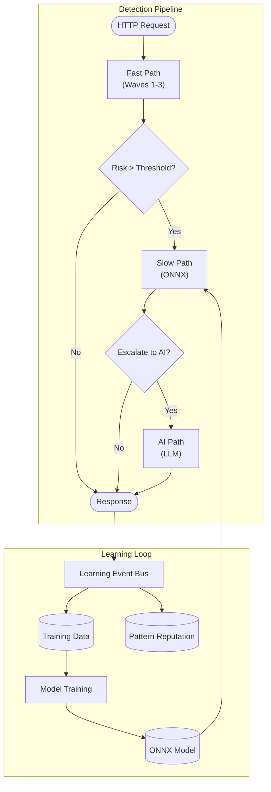
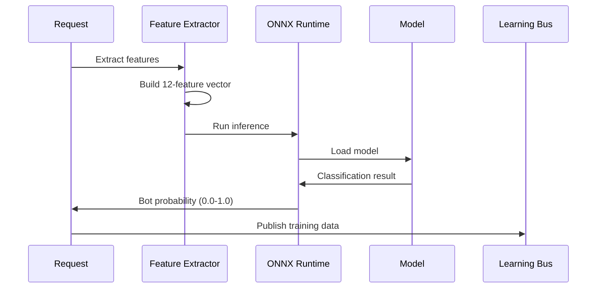
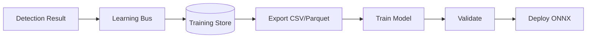
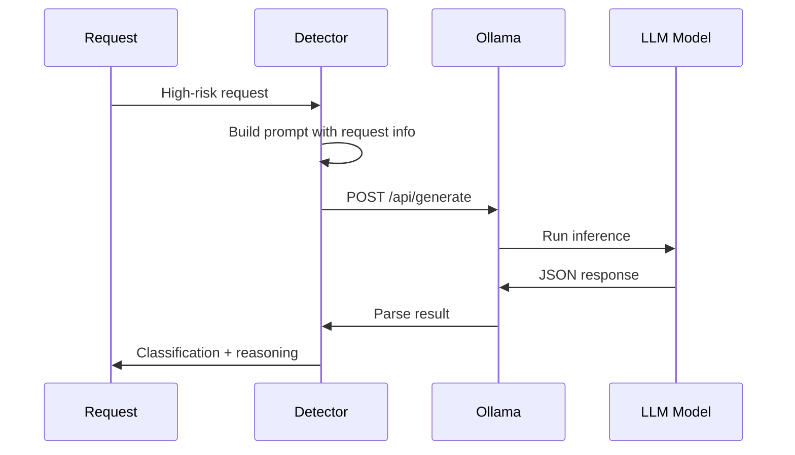
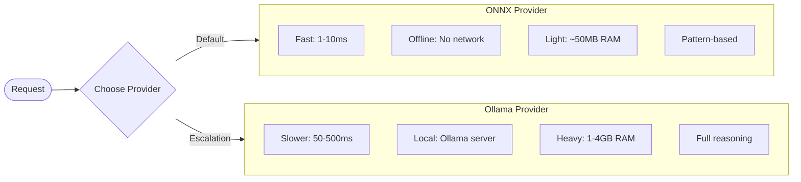
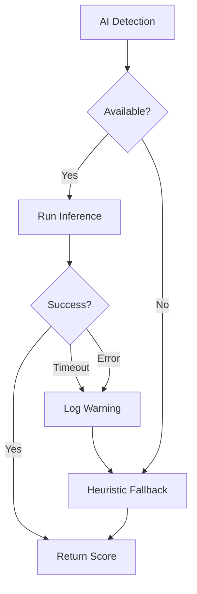

# AI Detection

The AI detection system provides machine learning-based bot classification using ONNX models and optional LLM inference. This is a **key feature** that enables continuous learning and adaptive detection.

## Architecture Overview



## Quick Start

### Recommended Configuration

```json
{
  "BotDetection": {
    "EnableAiDetection": true,
    "AiDetection": {
      "Provider": "Onnx",
      "TimeoutMs": 1000,
      "Onnx": {
        "AutoDownloadModel": true,
        "EnableHeuristicFallback": true,
        "UseGpu": false
      }
    },
    "Learning": {
      "Enabled": true,
      "LearningRate": 0.1
    }
  }
}
```

### Code Configuration

```csharp
services.AddBotDetection(options =>
{
    options.EnableAiDetection = true;
    options.AiDetection = new AiDetectionOptions
    {
        Provider = AiProvider.Onnx,
        TimeoutMs = 1000,
        Onnx = new OnnxOptions
        {
            AutoDownloadModel = true,
            EnableHeuristicFallback = true,
            UseGpu = false
        }
    };
});

// Or use the convenience method
services.AddAdvancedBotDetection();
```

---

## ONNX Detection (Recommended)

ONNX provides fast, offline ML inference without external dependencies. This is the **recommended** provider for production.

### How It Works



### Feature Vector

The ONNX model uses 12 features extracted from each request:

| Feature | Description | Weight |
|---------|-------------|--------|
| `ua_length` | User-Agent string length | 0.15 |
| `ua_has_bot_keyword` | Contains "bot", "spider", etc. | 0.25 |
| `ua_has_version` | Contains version numbers | 0.10 |
| `header_count` | Number of HTTP headers | 0.12 |
| `has_accept_language` | Accept-Language present | 0.18 |
| `has_accept_encoding` | Accept-Encoding present | 0.08 |
| `has_cookies` | Cookie header present | 0.15 |
| `has_referer` | Referer header present | 0.10 |
| `is_datacenter_ip` | IP in datacenter range | 0.20 |
| `request_rate` | Requests per minute | 0.15 |
| `path_entropy` | Path randomness score | 0.08 |
| `timing_variance` | Request timing variance | 0.12 |

### Configuration Options

```json
{
  "BotDetection": {
    "AiDetection": {
      "Provider": "Onnx",
      "TimeoutMs": 1000,
      "MaxConcurrentRequests": 10,
      "Onnx": {
        "ModelPath": "models/bot_classifier.onnx",
        "AutoDownloadModel": true,
        "ModelDownloadUrl": "https://example.com/models/bot_classifier.onnx",
        "UseGpu": false,
        "GpuDeviceId": 0,
        "EnableHeuristicFallback": true,
        "InferenceThreads": 4,
        "EnableMemoryOptimization": true,
        "EnableProfiling": false
      }
    }
  }
}
```

| Option | Type | Default | Description |
|--------|------|---------|-------------|
| `ModelPath` | string | `models/bot_classifier.onnx` | Path to ONNX model file |
| `AutoDownloadModel` | bool | `true` | Download model if not present |
| `ModelDownloadUrl` | string | `""` | URL to download model from |
| `UseGpu` | bool | `false` | Enable CUDA GPU acceleration |
| `GpuDeviceId` | int | `0` | CUDA device ID (for multi-GPU) |
| `EnableHeuristicFallback` | bool | `true` | Use heuristic weights when no model |
| `InferenceThreads` | int | `4` | Threads for inference (CPU only) |
| `EnableMemoryOptimization` | bool | `true` | Optimize memory usage |
| `EnableProfiling` | bool | `false` | Enable performance profiling |

### GPU Acceleration (CUDA)

For high-throughput scenarios, enable GPU acceleration:

```json
{
  "BotDetection": {
    "AiDetection": {
      "Onnx": {
        "UseGpu": true,
        "GpuDeviceId": 0
      }
    }
  }
}
```

**Requirements:**
- NVIDIA GPU with CUDA support
- CUDA Toolkit 11.x or 12.x installed
- cuDNN library installed
- `Microsoft.ML.OnnxRuntime.Gpu` NuGet package

**Performance Comparison:**

| Mode | Latency | Throughput | Memory |
|------|---------|------------|--------|
| CPU (4 threads) | 5-10ms | ~200 req/s | ~50MB |
| GPU (RTX 3060) | 1-2ms | ~2000 req/s | ~200MB |
| GPU (A100) | <1ms | ~10000 req/s | ~500MB |

### Heuristic Fallback

When no ONNX model is available, the system uses heuristic weights:

```csharp
// Built-in fallback scoring
var score =
    (uaHasBotKeyword ? 0.4 : 0.0) +
    (isDatacenterIp ? 0.3 : 0.0) +
    (!hasAcceptLanguage ? 0.2 : 0.0) +
    (!hasCookies ? 0.1 : 0.0);
```

This ensures detection continues even without the ML model.

### Model Management

#### Auto-Download

```json
{
  "BotDetection": {
    "AiDetection": {
      "Onnx": {
        "AutoDownloadModel": true,
        "ModelDownloadUrl": "https://your-cdn.com/models/bot_classifier_v2.onnx"
      }
    }
  }
}
```

The model is downloaded on first request and cached locally.

#### Custom Model Path

```json
{
  "BotDetection": {
    "AiDetection": {
      "Onnx": {
        "ModelPath": "/opt/models/custom_bot_classifier.onnx",
        "AutoDownloadModel": false
      }
    }
  }
}
```

#### Model Hot-Reload

The system watches for model file changes and reloads automatically:

```csharp
// Model is reloaded when file changes
// No restart required
```

### Training Your Own Model

The learning system collects training data from detections:



**Export Training Data:**

```csharp
// Access via diagnostic endpoints
app.MapGet("/bot-detection/training-data", async (ILearnedPatternStore store) =>
{
    var data = await store.ExportTrainingDataAsync();
    return Results.File(data, "text/csv", "training_data.csv");
});
```

**Training Pipeline (Python):**

```python
import onnx
import pandas as pd
from sklearn.ensemble import GradientBoostingClassifier
from skl2onnx import convert_sklearn

# Load training data
df = pd.read_csv('training_data.csv')
X = df[['ua_length', 'ua_has_bot_keyword', ...]]  # 12 features
y = df['is_bot']

# Train model
model = GradientBoostingClassifier(n_estimators=100)
model.fit(X, y)

# Convert to ONNX
onnx_model = convert_sklearn(model, initial_types=[('input', FloatTensorType([None, 12]))])
onnx.save_model(onnx_model, 'bot_classifier.onnx')
```

---

## LLM Detection (Ollama)

For sophisticated bots that evade pattern matching, use LLM-based analysis.

### How It Works



### Setup

1. **Install Ollama:**
   ```bash
   # Linux/macOS
   curl -fsSL https://ollama.ai/install.sh | sh

   # Windows
   # Download from https://ollama.ai/download
   ```

2. **Pull a Model:**
   ```bash
   # Recommended for bot detection
   ollama pull gemma3:1b

   # Alternatives
   ollama pull tinyllama      # Fastest, basic
   ollama pull qwen2.5:1.5b   # Better reasoning
   ollama pull phi3:mini      # Microsoft's model
   ```

3. **Configure:**
   ```json
   {
     "BotDetection": {
       "EnableAiDetection": true,
       "AiDetection": {
         "Provider": "Ollama",
         "TimeoutMs": 3000,
         "Ollama": {
           "Endpoint": "http://localhost:11434",
           "Model": "gemma3:1b",
           "UseJsonMode": true
         }
       }
     }
   }
   ```

### Configuration Options

```json
{
  "BotDetection": {
    "AiDetection": {
      "Provider": "Ollama",
      "TimeoutMs": 3000,
      "MaxConcurrentRequests": 3,
      "Ollama": {
        "Endpoint": "http://localhost:11434",
        "Model": "gemma3:1b",
        "UseJsonMode": true,
        "Temperature": 0.1,
        "MaxTokens": 256,
        "CustomPrompt": null,
        "SystemPrompt": null,
        "RetryCount": 2,
        "RetryDelayMs": 100
      }
    }
  }
}
```

| Option | Type | Default | Description |
|--------|------|---------|-------------|
| `Endpoint` | string | `http://localhost:11434` | Ollama API endpoint |
| `Model` | string | `gemma3:1b` | Model name |
| `UseJsonMode` | bool | `true` | Request JSON output |
| `Temperature` | double | `0.1` | Randomness (0.0-1.0) |
| `MaxTokens` | int | `256` | Max response tokens |
| `CustomPrompt` | string | null | Custom analysis prompt |
| `SystemPrompt` | string | null | System context prompt |
| `RetryCount` | int | `2` | Retries on failure |
| `RetryDelayMs` | int | `100` | Delay between retries |

### Custom Prompts

Override the default analysis prompt:

```json
{
  "BotDetection": {
    "AiDetection": {
      "Ollama": {
        "CustomPrompt": "Analyze this HTTP request for bot indicators.\n\n{REQUEST_INFO}\n\nRespond with JSON:\n{\"isBot\": boolean, \"confidence\": 0.0-1.0, \"reasoning\": \"...\", \"botType\": \"...\", \"indicators\": [...]}"
      }
    }
  }
}
```

**Template Variables:**

| Variable | Content |
|----------|---------|
| `{REQUEST_INFO}` | Full request details (headers, path, etc.) |
| `{USER_AGENT}` | User-Agent string |
| `{HEADERS}` | HTTP headers JSON |
| `{IP_INFO}` | IP and datacenter info |
| `{BEHAVIOR}` | Behavioral stats |

### Recommended Models

| Model | Size | Context | Speed | Accuracy | Use Case |
|-------|------|---------|-------|----------|----------|
| `gemma3:1b` | 1B | 8K | ~50ms | Good | **Default - best balance** |
| `tinyllama` | 1.1B | 2K | ~20ms | Basic | High throughput |
| `qwen2.5:1.5b` | 1.5B | 32K | ~80ms | Better | Complex patterns |
| `phi3:mini` | 3.8B | 4K | ~150ms | Best | Low volume, high accuracy |
| `llama3.2:3b` | 3B | 8K | ~200ms | Best | Research/analysis |

### GPU Acceleration

Ollama automatically uses GPU if available:

```bash
# Check GPU status
ollama ps

# Force CPU-only
OLLAMA_NO_GPU=1 ollama serve
```

**VRAM Requirements:**

| Model | CPU RAM | GPU VRAM |
|-------|---------|----------|
| tinyllama | ~2GB | ~1GB |
| gemma3:1b | ~3GB | ~2GB |
| phi3:mini | ~6GB | ~4GB |
| llama3.2:3b | ~8GB | ~6GB |

---

## Provider Comparison



| Feature | ONNX | Ollama |
|---------|------|--------|
| **Latency** | 1-10ms | 50-500ms |
| **Accuracy** | Good (pattern-based) | Best (full reasoning) |
| **Resources** | ~50MB RAM | 1-4GB RAM |
| **Dependencies** | None (in-process) | Ollama server |
| **Offline** | Yes | Yes (local) |
| **GPU** | Optional CUDA | Automatic |
| **Learning** | Continuous | Static |

### Recommendation

1. **Start with ONNX** - Fast, low overhead, good accuracy
2. **Add Ollama for escalation** - Catch sophisticated bots
3. **Enable learning** - Continuous improvement

```json
{
  "BotDetection": {
    "EnableAiDetection": true,
    "AiDetection": {
      "Provider": "Onnx",
      "Onnx": {
        "AutoDownloadModel": true,
        "EnableHeuristicFallback": true
      }
    },
    "FastPath": {
      "SlowPathDetectors": [
        { "Name": "ONNX Detector", "Signal": "OnnxCompleted", "Wave": 1 }
      ],
      "AiPathDetectors": [
        { "Name": "LLM Detector", "Signal": "LlmCompleted", "Wave": 1 }
      ]
    },
    "Policies": {
      "strict": {
        "EscalateToAi": true,
        "AiEscalationThreshold": 0.6
      }
    }
  }
}
```

---

## Fail-Safe Behavior

AI detection is designed to fail gracefully:



**Guarantees:**
- AI detection **never blocks** the pipeline
- Timeouts are logged, not thrown
- Heuristic fallback always available
- Circuit breaker prevents cascade failures

---

## Monitoring

### Metrics

```csharp
// OpenTelemetry metrics
bot_detection_ai_inference_duration_seconds
bot_detection_ai_inference_total
bot_detection_ai_inference_errors_total
bot_detection_ai_model_loaded
bot_detection_ai_gpu_memory_bytes
```

### Health Check

```csharp
app.MapHealthChecks("/health/ai", new HealthCheckOptions
{
    Predicate = check => check.Tags.Contains("ai")
});
```

### Diagnostic Endpoint

```bash
GET /bot-detection/ai-status

{
  "provider": "Onnx",
  "modelLoaded": true,
  "modelPath": "models/bot_classifier.onnx",
  "modelVersion": "2.1.0",
  "gpuEnabled": false,
  "inferenceCount": 12345,
  "averageLatencyMs": 3.2,
  "heuristicFallbackActive": false
}
```

---

## Troubleshooting

### ONNX Model Not Loading

```
Error: Failed to load ONNX model from 'models/bot_classifier.onnx'
```

**Solutions:**
1. Check file path exists
2. Verify file permissions
3. Enable `AutoDownloadModel`
4. Check `ModelDownloadUrl` is accessible

### GPU Not Detected

```
Warning: CUDA not available, falling back to CPU
```

**Solutions:**
1. Install CUDA Toolkit 11.x+
2. Install cuDNN
3. Add `Microsoft.ML.OnnxRuntime.Gpu` package
4. Check `nvidia-smi` works

### Ollama Connection Failed

```
Error: Failed to connect to Ollama at http://localhost:11434
```

**Solutions:**
1. Start Ollama: `ollama serve`
2. Check endpoint URL
3. Verify firewall settings
4. Pull required model: `ollama pull gemma3:1b`

### High Latency

**ONNX slow:**
- Enable GPU
- Increase `InferenceThreads`
- Enable `EnableMemoryOptimization`

**Ollama slow:**
- Use smaller model (tinyllama)
- Reduce `MaxTokens`
- Check GPU utilization
