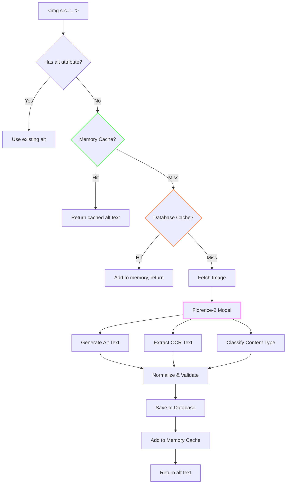

# Alt Text Generation: Teaching a Vision Model to Describe What It Sees

"A picture is worth a thousand words"—but if you're blind, a picture is worth nothing without those words. Enter automated alt text generation.

<datetime class="hidden">2025-11-22T11:30</datetime>
<!-- category -- .NET, Accessibility, AI, Vision Models, NuGet, AI-Article -->

# Introduction

Web accessibility isn't optional—it's both a moral imperative and often a legal requirement. The `alt` attribute on images provides descriptions for screen reader users, search engines, and anyone whose images don't load. But writing good alt text is tedious, and most developers... don't.

The **Mostlylucid.LlmAltText** library automates this using Microsoft's Florence-2 Vision Language Model (VLM). Point it at an image, get a description. Point it at a screenshot, get OCR text. All running locally, no cloud APIs, no per-image fees.

**Why Florence-2?** It's a powerful vision model that runs efficiently on consumer hardware (~2-4GB RAM), supports multiple tasks (captioning, OCR, object detection), and produces remarkably good descriptions.

[TOC]

# The Architecture: Vision Model + Smart Caching

Alt text generation has a simple flow but needs smart optimization—you don't want to re-process images you've already seen.



## The Two-Layer Cache

**Layer 1: Memory** (< 1ms)
- IMemoryCache with 60-minute TTL
- Key: SHA256 hash of image source URL

**Layer 2: Database** (< 50ms)
- SQLite or PostgreSQL via EF Core
- Persists across app restarts
- Tracks usage counts for analytics

Why both? Memory cache handles hot paths (same image on multiple pages), database handles cold starts (app restart, new server instance).

# The Vision Model: Florence-2

Florence-2 is Microsoft's vision-language model, trained on 900M image-text pairs. It excels at:
- **Image captioning**: "A cat sitting on a wooden table"
- **Detailed descriptions**: "A tabby cat with orange and white fur sitting on a rustic wooden table, looking at the camera with green eyes"
- **OCR**: Extracting text from screenshots, documents, signs

```csharp
public class Florence2ImageAnalysisService : IImageAnalysisService, IDisposable
{
    private Florence2Model? _model;

    public async Task<string> GenerateAltTextAsync(Stream imageStream, string taskType = "MORE_DETAILED_CAPTION")
    {
        await EnsureInitializedAsync();

        var task = ResolveTaskType(taskType, TaskTypes.MORE_DETAILED_CAPTION);

        var startTime = DateTime.UtcNow;

        // Core Florence-2 invocation
        var results = _model!.Run(task, new[] { imageStream }, _options.AltTextPrompt, CancellationToken.None);
        var altText = results.FirstOrDefault()?.PureText;

        var duration = (DateTime.UtcNow - startTime).TotalMilliseconds;
        LogInfo($"Alt text generated in {duration:F0}ms");

        if (string.IsNullOrWhiteSpace(altText))
        {
            _logger.LogWarning("No alt text generated for image");
            return "No description available";
        }

        return NormalizeAltText(altText);
    }
}
```

**Task Types Explained:**
| Task | Output | Use Case |
|------|--------|----------|
| `CAPTION` | Brief, 1 sentence | Simple images |
| `DETAILED_CAPTION` | 2-3 sentences | Most images |
| `MORE_DETAILED_CAPTION` | Full description | Complex scenes, accessibility |
| `OCR` | Extracted text | Screenshots, documents |

# Combined Analysis: Alt Text + OCR + Classification

For comprehensive image understanding, we run multiple analyses:

```csharp
public async Task<ImageAnalysisResult> AnalyzeWithClassificationAsync(Stream imageStream)
{
    await EnsureInitializedAsync();

    var startTime = DateTime.UtcNow;

    // Create memory stream for multiple reads
    using var memoryStream = new MemoryStream();
    await imageStream.CopyToAsync(memoryStream);

    // Generate alt text
    memoryStream.Position = 0;
    var altText = await GenerateAltTextAsync(memoryStream, _options.DefaultTaskType);

    // Extract text (OCR)
    memoryStream.Position = 0;
    var extractedText = await ExtractTextAsync(memoryStream);

    // Classify content type from results
    var (contentType, confidence) = ClassifyFromResults(altText, extractedText, memoryStream.Length);

    var duration = (DateTime.UtcNow - startTime).TotalMilliseconds;
    LogInfo($"Complete analysis finished in {duration:F0}ms");

    return new ImageAnalysisResult
    {
        AltText = altText,
        ExtractedText = extractedText,
        ContentType = contentType,
        ContentTypeConfidence = confidence,
        HasSignificantText = !string.IsNullOrWhiteSpace(extractedText) &&
                            extractedText != "No text found" &&
                            extractedText.Length > 20
    };
}
```

**Why OCR matters for alt text**: If an image contains text (screenshots, infographics, signs), the description should include that text. A screenshot of a terminal isn't just "a computer screen"—it's the commands shown.

# Content Classification: What Kind of Image Is This?

Different image types need different descriptions. The classifier uses keyword analysis combined with OCR results:

```csharp
private (ImageContentType Type, double Confidence) ClassifyFromResults(
    string altText, string extractedText, long imageSize)
{
    var altLower = altText.ToLowerInvariant();
    var ocrLength = extractedText?.Length ?? 0;
    var hasOcrText = !string.IsNullOrWhiteSpace(extractedText) &&
                     extractedText != "No text found";

    // Keyword sets for classification
    var documentKeywords = new[] { "document", "text", "paper", "page", "form",
        "letter", "contract", "invoice", "receipt", "pdf", "printed" };
    var screenshotKeywords = new[] { "screenshot", "screen", "window", "browser",
        "desktop", "interface", "ui", "menu", "button", "toolbar" };
    var chartKeywords = new[] { "chart", "graph", "diagram", "plot", "bar chart",
        "pie chart", "line graph", "statistics", "data visualization" };
    var photoKeywords = new[] { "photo", "photograph", "picture", "image of",
        "person", "people", "landscape", "building", "outdoor", "nature" };

    // Calculate scores with OCR weighting
    var scores = new Dictionary<ImageContentType, double>
    {
        [ImageContentType.Document] =
            CalculateKeywordScore(altLower, documentKeywords) +
            (hasOcrText && ocrLength > 100 ? 0.4 : 0),

        [ImageContentType.Screenshot] =
            CalculateKeywordScore(altLower, screenshotKeywords) +
            (hasOcrText && ocrLength > 20 && ocrLength < 500 ? 0.2 : 0),

        [ImageContentType.Chart] =
            CalculateKeywordScore(altLower, chartKeywords),

        [ImageContentType.Photograph] =
            CalculateKeywordScore(altLower, photoKeywords) +
            (hasOcrText ? -0.1 : 0.2) // Photos rarely have text
    };

    // High OCR text strongly suggests document
    if (hasOcrText && ocrLength > 200)
        scores[ImageContentType.Document] += 0.3;

    var bestMatch = scores.OrderByDescending(x => x.Value).First();

    if (bestMatch.Value < 0.1)
    {
        // Default: if has text, probably document; otherwise photo
        if (hasOcrText && ocrLength > 50)
            return (ImageContentType.Document, 0.5);
        return (ImageContentType.Photograph, 0.4);
    }

    return (bestMatch.Key, Math.Min(bestMatch.Value, 1.0));
}
```

**Content Types:**
```csharp
public enum ImageContentType
{
    Unknown,       // Unclassified
    Photograph,    // Real-world scenes
    Document,      // Text-heavy (forms, letters)
    Screenshot,    // Software UI
    Chart,         // Data visualizations
    Illustration,  // Artwork, drawings
    Diagram        // Flowcharts, schematics
}
```

# Alt Text Normalization

Good alt text follows accessibility guidelines. The normalizer ensures consistency:

```csharp
private string NormalizeAltText(string altText)
{
    var normalized = altText.Trim();

    // Ensure proper sentence ending
    if (!normalized.EndsWith(".") && !normalized.EndsWith("!") && !normalized.EndsWith("?"))
        normalized += ".";

    // Check word count (accessibility recommendation: ~125 characters / ~90 words)
    var wordCount = normalized.Split(new[] { ' ', '\t', '\n' },
        StringSplitOptions.RemoveEmptyEntries).Length;

    if (wordCount > _options.MaxWords)
        _logger.LogWarning(
            "Generated alt text has {WordCount} words, exceeding recommended maximum of {MaxWords}",
            wordCount, _options.MaxWords);

    return normalized;
}
```

**Accessibility Best Practices:**
- 125 characters or fewer (screen readers work better)
- End with punctuation (natural speech flow)
- Describe content, not "image of" or "picture of"
- Include text visible in the image
- Context matters: button icon vs decorative image

# The ASP.NET Core TagHelper: Automatic Alt Text

The killer feature: drop in a TagHelper and existing `` tags get auto-generated alt text:

```csharp
[HtmlTargetElement("img", Attributes = "auto-alt")]
public class AutoAltTextTagHelper : TagHelper
{
    private readonly IImageAnalysisService _imageAnalysisService;
    private readonly IMemoryCache _cache;
    private readonly IAltTextRepository? _repository;

    public override async Task ProcessAsync(TagHelperContext context, TagHelperOutput output)
    {
        // Skip if already has alt text
        if (output.Attributes.ContainsName("alt"))
        {
            var existingAlt = output.Attributes["alt"]?.Value?.ToString();
            if (!string.IsNullOrWhiteSpace(existingAlt))
                return;
        }

        // Get image source
        var src = output.Attributes["src"]?.Value?.ToString();
        if (string.IsNullOrEmpty(src))
            return;

        // Skip data URIs and blob URLs
        if (src.StartsWith("data:") || src.StartsWith("blob:"))
            return;

        // Generate or retrieve alt text
        var altText = await GetOrGenerateAltTextAsync(src);

        if (!string.IsNullOrEmpty(altText))
        {
            output.Attributes.SetAttribute("alt", altText);
        }

        // Remove the auto-alt attribute from output
        output.Attributes.RemoveAll("auto-alt");
    }

    private async Task<string?> GetOrGenerateAltTextAsync(string src)
    {
        var cacheKey = $"alttext_{ComputeHash(src)}";

        // Try memory cache
        if (_cache.TryGetValue(cacheKey, out string? cached))
            return cached;

        // Try database cache
        if (_repository != null && _options.EnableDatabase)
        {
            var dbEntry = await _repository.GetBySourceAsync(src);
            if (dbEntry != null)
            {
                await _repository.IncrementUsageAsync(dbEntry.Id);
                _cache.Set(cacheKey, dbEntry.AltText, TimeSpan.FromMinutes(60));
                return dbEntry.AltText;
            }
        }

        // Generate new alt text
        var imageStream = await FetchImageAsync(src);
        if (imageStream == null) return null;

        using (imageStream)
        {
            var result = await _imageAnalysisService.AnalyzeWithClassificationAsync(imageStream);

            // Save to database
            if (_repository != null && _options.EnableDatabase)
            {
                await _repository.SaveAsync(new ImageAltTextEntry
                {
                    SourceHash = ComputeHash(src),
                    ImageSource = src,
                    AltText = result.AltText,
                    ExtractedText = result.ExtractedText,
                    ContentType = result.ContentType.ToString(),
                    ContentTypeConfidence = result.ContentTypeConfidence
                });
            }

            // Cache in memory
            _cache.Set(cacheKey, result.AltText, TimeSpan.FromMinutes(60));

            return result.AltText;
        }
    }
}
```

**Usage in Razor:**
```html
<!-- Before: missing alt text -->


<!-- After: automatic alt text -->

```

# Database Caching: Don't Process Twice

The repository layer persists alt text for reuse:

```csharp
public class ImageAltTextEntry
{
    [Key]
    public int Id { get; set; }

    [Required, MaxLength(64)]
    public required string SourceHash { get; set; }  // SHA256 of URL

    [Required, MaxLength(2048)]
    public required string ImageSource { get; set; }

    [MaxLength(64)]
    public string? ContentHash { get; set; }  // Hash of image bytes

    [Required]
    public required string AltText { get; set; }

    public string? ExtractedText { get; set; }

    [MaxLength(50)]
    public string? ContentType { get; set; }

    public double? ContentTypeConfidence { get; set; }

    public DateTime CreatedAt { get; set; } = DateTime.UtcNow;
    public DateTime UpdatedAt { get; set; } = DateTime.UtcNow;
    public int UsageCount { get; set; } = 1;  // Track popularity
    public bool IsManuallyReviewed { get; set; } = false;  // Human verified
}
```

**Indexing Strategy:**
```csharp
protected override void OnModelCreating(ModelBuilder modelBuilder)
{
    modelBuilder.Entity<ImageAltTextEntry>(entity =>
    {
        // Fast lookup by source URL hash
        entity.HasIndex(e => e.SourceHash)
            .IsUnique()
            .HasDatabaseName("IX_ImageAltTexts_SourceHash");

        // Duplicate detection by content hash
        entity.HasIndex(e => e.ContentHash)
            .HasDatabaseName("IX_ImageAltTexts_ContentHash");

        // Cleanup by age
        entity.HasIndex(e => e.CreatedAt)
            .HasDatabaseName("IX_ImageAltTexts_CreatedAt");
    });
}
```

**Cleanup Old Entries:**
```csharp
public async Task<int> CleanupOldEntriesAsync(DateTime olderThan, int minUsageCount = 1)
{
    var entriesToDelete = await _context.ImageAltTexts
        .Where(e => e.CreatedAt < olderThan &&
                    e.UsageCount < minUsageCount &&
                    !e.IsManuallyReviewed)  // Keep human-verified
        .ToListAsync();

    _context.ImageAltTexts.RemoveRange(entriesToDelete);
    await _context.SaveChangesAsync();

    return entriesToDelete.Count;
}
```

# The REST API: Programmatic Access

For programmatic use, a controller exposes the service:

```csharp
[ApiController]
[Route("api/[controller]")]
public class ImageAnalysisController : ControllerBase
{
    private readonly IImageAnalysisService _imageAnalysisService;

    [HttpPost("analyze")]
    [RequestSizeLimit(10 * 1024 * 1024)]  // 10MB limit
    public async Task<IActionResult> AnalyzeImage(IFormFile image)
    {
        if (image == null || image.Length == 0)
            return BadRequest(new { error = "No image file provided" });

        // Validate image type
        var allowedTypes = new[] { "image/jpeg", "image/png", "image/gif", "image/webp" };
        if (!allowedTypes.Contains(image.ContentType.ToLower()))
            return BadRequest(new { error = "Invalid image type" });

        using var stream = image.OpenReadStream();
        var result = await _imageAnalysisService.AnalyzeWithClassificationAsync(stream);

        return Ok(new
        {
            fileName = image.FileName,
            altText = result.AltText,
            extractedText = result.ExtractedText,
            contentType = result.ContentType.ToString(),
            contentTypeConfidence = result.ContentTypeConfidence,
            hasSignificantText = result.HasSignificantText,
            size = image.Length
        });
    }

    [HttpPost("alt-text")]
    public async Task<IActionResult> GenerateAltText(IFormFile image,
        [FromQuery] string taskType = "MORE_DETAILED_CAPTION")
    {
        using var stream = image.OpenReadStream();
        var altText = await _imageAnalysisService.GenerateAltTextAsync(stream, taskType);

        return Ok(new { altText, taskType });
    }

    [HttpPost("ocr")]
    public async Task<IActionResult> ExtractText(IFormFile image)
    {
        using var stream = image.OpenReadStream();
        var extractedText = await _imageAnalysisService.ExtractTextAsync(stream);

        return Ok(new { extractedText });
    }
}
```

# Configuration

```csharp
public class AltTextOptions
{
    public string ModelPath { get; set; } = "./models";  // ~800MB storage
    public string AltTextPrompt { get; set; } =
        "Provide 2-3 complete, descriptive alt text sentences for this image.";
    public string DefaultTaskType { get; set; } = "MORE_DETAILED_CAPTION";
    public bool EnableDiagnosticLogging { get; set; } = true;
    public int MaxWords { get; set; } = 90;  // Accessibility recommendation
    public bool EnableDatabase { get; set; } = true;
    public bool EnableTagHelper { get; set; } = true;
    public int CacheDurationMinutes { get; set; } = 60;
    public AltTextDbProvider DbProvider { get; set; } = AltTextDbProvider.Sqlite;
    public string? ConnectionString { get; set; }
    public string SqliteDbPath { get; set; } = "alttext.db";
}
```

# Service Registration

```csharp
// Program.cs
builder.Services.AddAltTextGeneration(options =>
{
    options.ModelPath = "./models";
    options.EnableDatabase = true;
    options.EnableTagHelper = true;
    options.DbProvider = AltTextDbProvider.Sqlite;
});

// In Razor views, use:
// 
```

# Performance Characteristics

| Operation | Time | Notes |
|-----------|------|-------|
| Model initialization | 1-3s | Once per app lifetime |
| Alt text generation | 500-2000ms | Depends on image size |
| OCR extraction | 500-1500ms | More text = slower |
| Memory cache hit | < 1ms | Hot path |
| Database cache hit | < 50ms | Warm path |
| Model RAM usage | ~2-4GB | Shared singleton |

**Optimization Tips:**
- The service is registered as a Singleton—model loads once
- Use database caching for production (survives restarts)
- Batch process images during off-peak hours for catalog sites
- Consider async queuing for user uploads

# Connection to Other Projects

**Borrowed Technique - Caching Pattern**: The two-layer cache (memory + database) follows the same pattern as [GeoDetection](/blog/geo-detection-internals). Both services deal with data that changes rarely but is expensive to compute.

**Future Enhancement**: Combine with [Bot Detection](/blog/bot-detection-internals) to skip alt text generation for bot requests—they don't need accessibility features.

# Conclusion: Accessibility Automated

The Mostlylucid.LlmAltText library demonstrates that accessibility doesn't have to be tedious:

**Key Features:**
- Florence-2 vision model (local, no API costs)
- Multiple outputs: alt text, OCR, classification
- Two-layer caching (memory + database)
- ASP.NET Core TagHelper integration
- Usage tracking and cleanup
- Support for SQLite and PostgreSQL

**What It Enables:**
- Automatic alt text for existing image tags
- Retroactive accessibility compliance
- Searchable image content (via OCR)
- Content type detection for smart processing

The web should be accessible to everyone. With tools like this, it's becoming easier to make that a reality—one `` tag at a time.

## Resources

- [Mostlylucid.LlmAltText on NuGet](https://www.nuget.org/packages/Mostlylucid.LlmAltText)
- [Florence-2 Model](https://huggingface.co/microsoft/Florence-2-large)
- [WebAIM Alt Text Guidelines](https://webaim.org/techniques/alttext/)
- [WCAG 2.1 Image Requirements](https://www.w3.org/WAI/WCAG21/Understanding/non-text-content.html)
