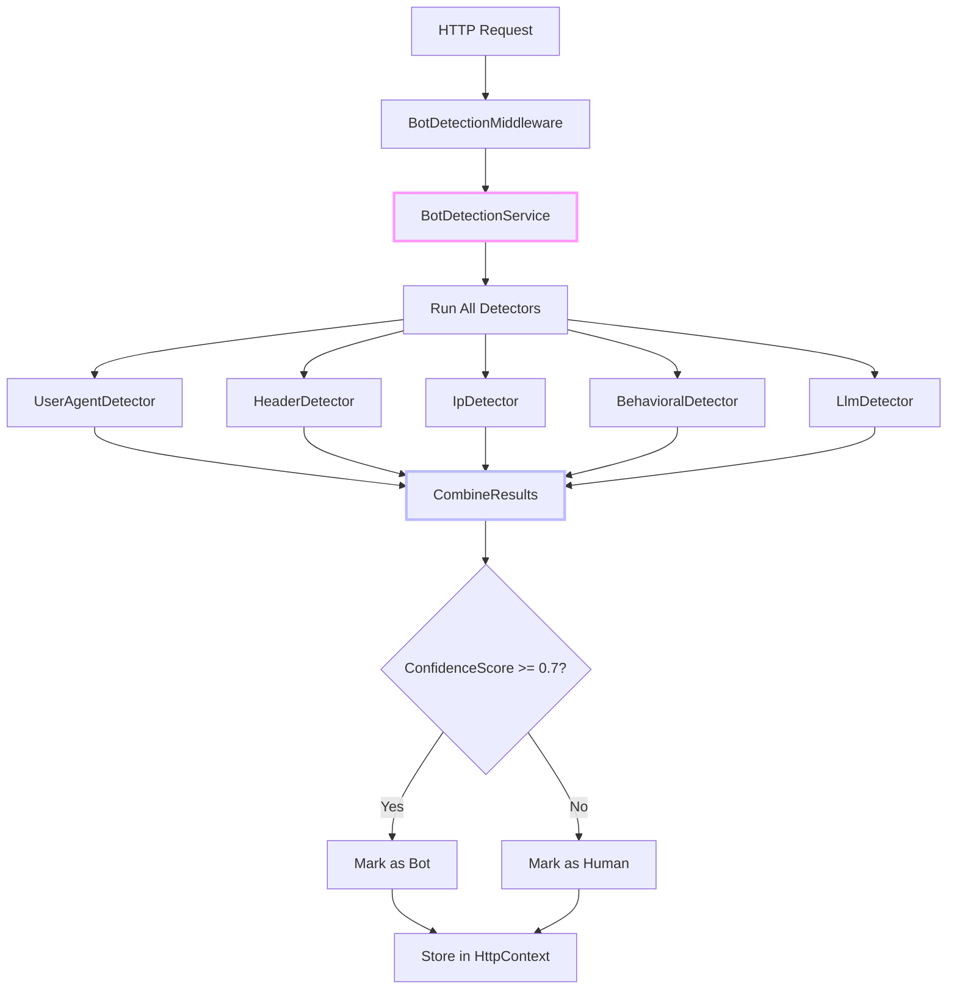
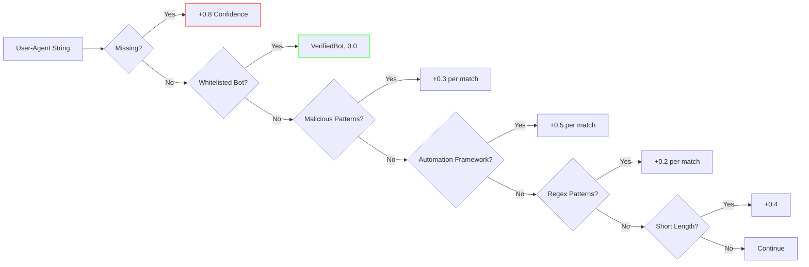
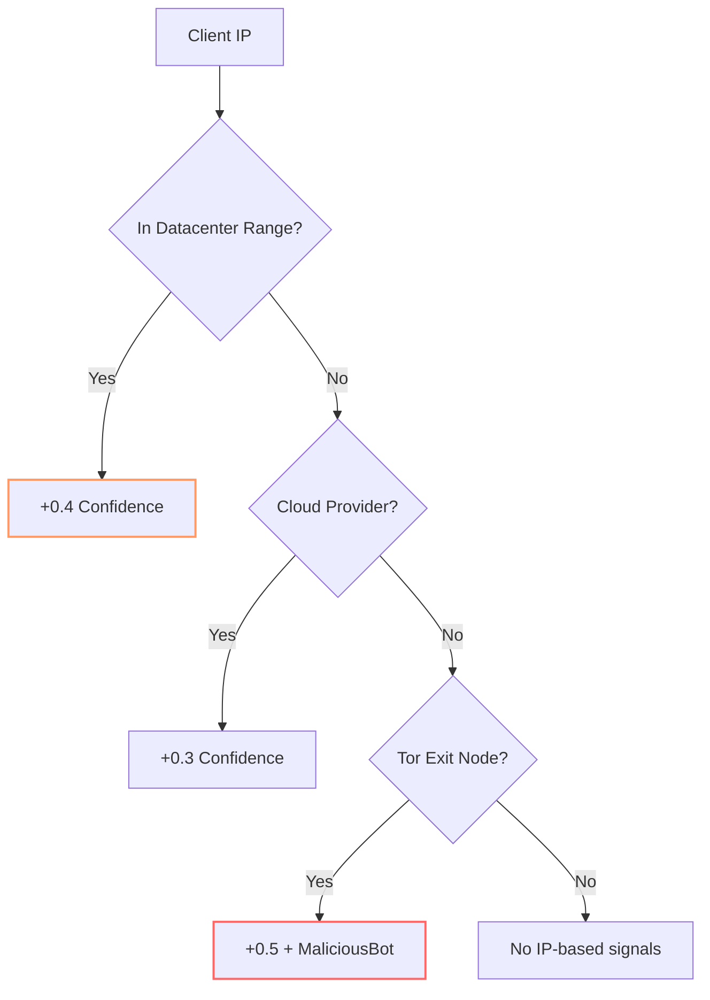

# Bot Detection: Teaching Your Server to Spot the Machines

Ever wonder how websites know you're not a robot (even before you start clicking fire hydrants)? Welcome to the fascinating world of bot detection, where every HTTP request tells a story—and some stories are clearly written by machines.

<datetime class="hidden">2025-11-22T10:00</datetime>
<!-- category -- .NET, Security, Bot Detection, ASP.NET Core, NuGet, AI-Article -->

# Introduction

In today's web, about 40% of all internet traffic is bot traffic. Some bots are friendly neighborhood crawlers (hello, Googlebot!), while others are scraping your content, testing stolen credentials, or probing for vulnerabilities. The **Mostlylucid.BotDetection** library is my approach to distinguishing humans from machines using a multi-layered detection strategy.

**What makes this interesting:** Instead of relying on a single detection method (which bots can easily evade), we combine *five independent signals* with a weighted scoring system. When multiple detectors agree, confidence increases. When they disagree, we err on the side of caution. And yes, there's even an optional AI layer for the really sneaky ones.

[TOC]

# The Architecture: Many Eyes See More

Bot detection is fundamentally a classification problem: given an HTTP request, determine if it came from a human or a machine. The trick is that sophisticated bots can mimic individual human behaviors, but mimicking *all* of them consistently is much harder.



The key insight: **agreement boosting**. If only the User-Agent detector raises an alarm (0.3 confidence), maybe it's a false positive. But if the User-Agent detector, Header detector, and IP detector all flag the request? That's a red flag worth investigating.

## The Detection Pipeline

When a request arrives, here's what happens:

1. **Cache Check**: First, we check if we've seen this combination before (IP + User-Agent hash)
2. **Parallel Detection**: All enabled detectors analyze the request simultaneously
3. **Score Combination**: Results are combined using weighted scoring with agreement boosting
4. **Result Caching**: Store the result for 5 minutes to avoid re-analyzing identical requests

```csharp
public async Task<BotDetectionResult> DetectAsync(HttpContext context,
    CancellationToken cancellationToken = default)
{
    var sw = Stopwatch.StartNew();

    // Check cache first
    var cacheKey = BuildCacheKey(context);
    if (_cache.TryGetValue<BotDetectionResult>(cacheKey, out var cachedResult) && cachedResult != null)
    {
        return cachedResult;
    }

    var result = new BotDetectionResult();
    var detectorResults = new List<DetectorResult>();

    // Run all enabled detectors
    foreach (var detector in _detectors)
        try
        {
            var detectorResult = await detector.DetectAsync(context, cancellationToken);
            detectorResults.Add(detectorResult);
        }
        catch (Exception ex)
        {
            _logger.LogError(ex, "Detector {Detector} failed", detector.Name);
        }

    // Combine results using weighted scoring
    result = CombineResults(detectorResults);
    sw.Stop();
    result.ProcessingTimeMs = sw.ElapsedMilliseconds;

    // Cache result
    _cache.Set(cacheKey, result, TimeSpan.FromSeconds(_options.CacheDurationSeconds));

    return result;
}
```

# Detector Deep Dive: The Five Eyes

Each detector looks at a different aspect of the request. Like crime scene investigators, they each bring a different expertise.

## 1. UserAgentDetector: Reading the Calling Card

Every HTTP client sends a User-Agent header identifying itself. Real browsers send detailed strings like:

```
Mozilla/5.0 (Windows NT 10.0; Win64; x64) AppleWebKit/537.36 (KHTML, like Gecko) Chrome/119.0.0.0 Safari/537.36
```

While bots often send... something less convincing:

```
python-requests/2.28.1
curl/7.68.0
```

The UserAgentDetector maintains a database of patterns:



**Key implementation detail**: All regex patterns have a 100ms timeout to prevent ReDoS (Regular Expression Denial of Service) attacks. A maliciously crafted User-Agent could otherwise hang your server with a slow regex:

```csharp
foreach (var pattern in BotSignatures.BotPatterns)
    try
    {
        if (Regex.IsMatch(userAgent, pattern, RegexOptions.IgnoreCase,
            TimeSpan.FromMilliseconds(100)))
        {
            confidence += 0.2;
            reasons.Add(new DetectionReason
            {
                Category = "User-Agent",
                Detail = $"Bot pattern matched: {pattern}",
                ConfidenceImpact = 0.2
            });
        }
    }
    catch (RegexMatchTimeoutException)
    {
        _logger.LogWarning("Regex timeout for pattern: {Pattern}", pattern);
    }
```

### The Bot Signatures Database

We maintain curated lists of known patterns. This borrows from the excellent [Matomo Device Detector](https://github.com/matomo-org/device-detector) project and the [crawler-user-agents](https://github.com/monperrus/crawler-user-agents) community list:

```csharp
public static readonly Dictionary<string, string> GoodBots = new()
{
    // Search Engines
    ["Googlebot"] = "Google Search",
    ["Bingbot"] = "Bing Search",
    ["Slurp"] = "Yahoo Search",
    ["DuckDuckBot"] = "DuckDuckGo",

    // Social Media
    ["facebookexternalhit"] = "Facebook",
    ["Twitterbot"] = "Twitter",
    ["LinkedInBot"] = "LinkedIn",

    // SEO Tools
    ["AhrefsBot"] = "Ahrefs SEO",
    ["SemrushBot"] = "SEMrush"
};

public static readonly HashSet<string> AutomationFrameworks = new()
{
    "Selenium", "WebDriver", "PhantomJS", "HeadlessChrome",
    "Puppeteer", "Playwright", "Cypress", "Mechanize"
};
```

## 2. HeaderDetector: Analyzing the Etiquette

Real browsers send a predictable set of headers in a predictable order. Bots often forget the social niceties.

```csharp
// Common headers sent by real browsers
private static readonly string[] CommonBrowserHeaders = new[]
{
    "Accept", "Accept-Encoding", "Accept-Language",
    "Cache-Control", "Connection", "Upgrade-Insecure-Requests"
};
```

**What we check:**

| Check | Impact | Reasoning |
|-------|--------|-----------|
| Missing Accept-Language | +0.2 | Real browsers always negotiate language |
| Generic Accept (*/*) without language | +0.2 | API clients do this, browsers don't |
| Automation headers (X-Requested-With) | +0.4 | Testing frameworks add these |
| Very few headers (< 4) | +0.3 | Real browsers send 5-10+ headers |
| User-Agent not in first 5 headers | +0.1 | Unusual ordering pattern |

```csharp
// Check for missing common browser headers (+0.15 per missing, max 0.6)
var missingHeaders = CommonBrowserHeaders.Where(h => !headers.ContainsKey(h)).ToList();
if (missingHeaders.Any())
{
    var impact = Math.Min(missingHeaders.Count * 0.15, 0.6);
    confidence += impact;
    reasons.Add(new DetectionReason
    {
        Category = "Headers",
        Detail = $"Missing common browser headers: {string.Join(", ", missingHeaders)}",
        ConfidenceImpact = impact
    });
}
```

## 3. IpDetector: Know Your Neighborhood

Legitimate users browse from residential or mobile IPs. Bots often run from datacenters.



**External Data Sources**: We use publicly available IP ranges from major cloud providers:

```csharp
public static class BotListSources
{
    // AWS IP Ranges (official, updated regularly)
    public const string AwsIpRanges = "https://ip-ranges.amazonaws.com/ip-ranges.json";

    // Google Cloud IP Ranges (official)
    public const string GcpIpRanges = "https://www.gstatic.com/ipranges/cloud.json";

    // Cloudflare IP Ranges (official TXT format)
    public const string CloudflareIpv4 = "https://www.cloudflare.com/ips-v4";
}
```

The IP detector uses CIDR subnet matching to check if an IP falls within known datacenter ranges:

```csharp
private bool IsInSubnet(IPAddress ipAddress, string cidr)
{
    var parts = cidr.Split('/');
    if (!IPAddress.TryParse(parts[0], out var networkAddress)) return false;
    if (!int.TryParse(parts[1], out var prefixLength)) return false;

    var ipBytes = ipAddress.GetAddressBytes();
    var networkBytes = networkAddress.GetAddressBytes();

    var maskBytes = prefixLength / 8;
    var maskBits = prefixLength % 8;

    // Check full bytes
    for (var i = 0; i < maskBytes; i++)
        if (ipBytes[i] != networkBytes[i])
            return false;

    // Check remaining bits
    if (maskBits > 0 && maskBytes < ipBytes.Length)
    {
        var mask = (byte)(0xFF << (8 - maskBits));
        if ((ipBytes[maskBytes] & mask) != (networkBytes[maskBytes] & mask))
            return false;
    }

    return true;
}
```

## 4. BehavioralDetector: Watching the Dance

Humans are unpredictable. They read, they pause, they scroll. Bots are efficient—too efficient.

```csharp
// Check for rapid sequential requests (< 100ms = definitely bot)
var lastRequestTime = GetLastRequestTime(ipAddress);
var currentTime = DateTime.UtcNow;
if (lastRequestTime.HasValue)
{
    var timeSinceLastRequest = (currentTime - lastRequestTime.Value).TotalMilliseconds;
    if (timeSinceLastRequest < 100) // Less than 100ms between requests
    {
        confidence += 0.4;
        reasons.Add(new DetectionReason
        {
            Category = "Behavioral",
            Detail = $"Extremely fast requests: {timeSinceLastRequest:F0}ms between requests",
            ConfidenceImpact = 0.4
        });
    }
}
```

**The Timing Variance Analysis**: This is where it gets clever. Humans naturally vary their request timing—sometimes they click fast, sometimes they wander off for coffee. Bots often make requests at suspiciously regular intervals.

```csharp
private (bool IsSuspicious, string Description) AnalyzeRequestTiming(string ipAddress)
{
    var timings = GetTimings(ipAddress); // Last 10 request timestamps

    if (timings.Count >= 5)
    {
        var intervals = new List<double>();
        for (var i = 1; i < timings.Count; i++)
            intervals.Add((timings[i] - timings[i - 1]).TotalSeconds);

        // Calculate standard deviation
        var mean = intervals.Average();
        var variance = intervals.Average(x => Math.Pow(x - mean, 2));
        var stdDev = Math.Sqrt(variance);

        // Very low std dev means requests are too regular (bot behavior)
        if (stdDev < 0.5 && mean < 5)
            return (true, $"Too regular interval: {mean:F2}s ± {stdDev:F2}s");
    }

    return (false, string.Empty);
}
```

**Statistical Insight**: A standard deviation below 0.5 seconds on request intervals, combined with a mean interval under 5 seconds, indicates machine-like precision. Humans simply can't click that consistently.

## 5. LlmDetector: The AI Wild Card (Optional)

For the sophisticated bots that pass all the rule-based checks, we can optionally call in AI backup. This uses a local Ollama instance with a small, fast model:

```csharp
var prompt = $@"You are an expert at detecting bot traffic from HTTP requests.
Analyze this request and determine if it's likely from a bot or legitimate user.

Request Information:
{requestInfo}

Respond ONLY with a valid JSON object in this exact format:
{{
  ""isBot"": true/false,
  ""confidence"": 0.0-1.0,
  ""reasoning"": ""brief explanation"",
  ""botType"": ""scraper/searchengine/monitor/malicious/unknown"",
  ""pattern"": ""key identifying pattern if bot""
}}

Important:
- Look for missing browser headers (Accept-Language, Referer)
- Simple User-Agents without version details are suspicious
- Be conservative: when in doubt, prefer false negatives over false positives
";
```

**The Self-Learning Feature**: When the LLM detects a bot with high confidence (> 0.8), we save the pattern for future reference:

```csharp
private async Task LearnPattern(string requestInfo, LlmAnalysis analysis, CancellationToken ct)
{
    if (string.IsNullOrEmpty(analysis.Pattern)) return;

    var learnedPatterns = await LoadLearnedPatterns(ct);

    var existing = learnedPatterns.FirstOrDefault(p =>
        p.Pattern.Equals(analysis.Pattern, StringComparison.OrdinalIgnoreCase));

    if (existing != null)
    {
        existing.LastSeen = DateTime.UtcNow;
        existing.OccurrenceCount++;
        existing.Confidence = Math.Max(existing.Confidence, analysis.Confidence);
    }
    else
    {
        learnedPatterns.Add(new LearnedPattern
        {
            Pattern = analysis.Pattern,
            BotType = analysis.BotType.ToString(),
            Confidence = analysis.Confidence,
            FirstSeen = DateTime.UtcNow,
            LastSeen = DateTime.UtcNow,
            OccurrenceCount = 1
        });
        _logger.LogInformation("Learned new bot pattern: {Pattern}", analysis.Pattern);
    }

    await SaveLearnedPatterns(learnedPatterns, ct);
}
```

# The Agreement Boosting Algorithm

Here's where the magic happens. Individual detectors might have false positives, but when multiple independent signals agree, confidence should increase more than linearly:

```csharp
private BotDetectionResult CombineResults(List<DetectorResult> detectorResults)
{
    var result = new BotDetectionResult();

    // Collect all reasons
    foreach (var detectorResult in detectorResults)
        result.Reasons.AddRange(detectorResult.Reasons);

    // Calculate weighted confidence score
    var confidences = detectorResults.Select(r => r.Confidence).ToList();
    var maxConfidence = confidences.Any() ? confidences.Max() : 0.0;

    // Count how many detectors are suspicious
    var suspiciousDetectors = confidences.Count(c => c > 0.3);

    // Agreement boost: +10% per additional suspicious detector
    var agreementBoost = suspiciousDetectors > 1 ? (suspiciousDetectors - 1) * 0.1 : 0.0;

    result.ConfidenceScore = Math.Min(maxConfidence + agreementBoost, 1.0);
    result.IsBot = result.ConfidenceScore >= _options.BotThreshold;

    // Special handling for verified bots (whitelist)
    if (detectorResults.Any(r => r.BotType == BotType.VerifiedBot))
    {
        result.BotType = BotType.VerifiedBot;
        result.IsBot = false; // Verified bots are allowed
        result.ConfidenceScore = 0.0;
    }

    return result;
}
```

**Example Scenarios:**

| Scenario | Individual Scores | Agreement Boost | Final Score | Result |
|----------|------------------|-----------------|-------------|--------|
| Obvious bot (curl) | UA: 0.8, Headers: 0.6 | +0.1 | 0.9 | Bot |
| Datacenter IP only | IP: 0.4 | 0.0 | 0.4 | Human |
| Subtle scraper | UA: 0.3, Headers: 0.3, IP: 0.3 | +0.2 | 0.5 | Human |
| Aggressive scraper | UA: 0.5, Behavioral: 0.6, IP: 0.4 | +0.2 | 0.8 | Bot |
| Googlebot | UA: VerifiedBot | 0.0 | 0.0 | Allowed |

# External Data Sources

This project borrows extensively from the open-source community and official cloud provider documentation:

```csharp
public static class BotListSources
{
    // Matomo Device Detector (1000+ bot patterns in YAML)
    public const string MatomoBotList =
        "https://raw.githubusercontent.com/matomo-org/device-detector/master/regexes/bots.yml";

    // Crawler User Agents Community List
    public const string CrawlerUserAgents =
        "https://raw.githubusercontent.com/monperrus/crawler-user-agents/master/crawler-user-agents.json";

    // AWS IP Ranges (official)
    public const string AwsIpRanges = "https://ip-ranges.amazonaws.com/ip-ranges.json";

    // Google Cloud IP Ranges (official)
    public const string GcpIpRanges = "https://www.gstatic.com/ipranges/cloud.json";

    // Cloudflare IP Ranges
    public const string CloudflareIpv4 = "https://www.cloudflare.com/ips-v4";

    // IsBot Patterns (npm package)
    public const string IsBotPatterns = "https://unpkg.com/isbot@latest/src/list.json";
}
```

**Background Updates**: A hosted service checks for updates every 24 hours:

```csharp
public class BotListUpdateService : BackgroundService
{
    private static readonly TimeSpan UpdateInterval = TimeSpan.FromHours(24);

    protected override async Task ExecuteAsync(CancellationToken stoppingToken)
    {
        while (!stoppingToken.IsCancellationRequested)
        {
            await UpdateAllListsAsync(stoppingToken);
            await Task.Delay(UpdateInterval, stoppingToken);
        }
    }
}
```

# Usage: Putting It All Together

**Basic Setup:**

```csharp
// Program.cs
builder.Services.AddBotDetection(options =>
{
    options.BotThreshold = 0.7;                    // Confidence threshold
    options.EnableUserAgentDetection = true;
    options.EnableHeaderAnalysis = true;
    options.EnableIpDetection = true;
    options.EnableBehavioralAnalysis = true;
    options.EnableLlmDetection = false;           // Requires Ollama

    options.MaxRequestsPerMinute = 60;            // Behavioral threshold
    options.CacheDurationSeconds = 300;           // Cache for 5 minutes

    // Whitelist trusted bots
    options.WhitelistedBotPatterns = new()
    {
        "Googlebot", "Bingbot", "DuckDuckBot"
    };
});

app.UseBotDetection();
```

**In Controllers:**

```csharp
public class MyController : Controller
{
    public IActionResult Index()
    {
        var result = HttpContext.Items[BotDetectionMiddleware.BotDetectionResultKey]
            as BotDetectionResult;

        if (result?.IsBot == true)
        {
            _logger.LogWarning("Bot detected: {BotType}, Confidence: {Confidence}",
                result.BotType, result.ConfidenceScore);

            return StatusCode(403, "Bot traffic not allowed");
        }

        return View();
    }
}
```

**Test Mode**: For development, you can override detection with headers:

```bash
# Simulate Googlebot
curl -H "ml-bot-test-mode: googlebot" http://localhost/api/test

# Disable detection
curl -H "ml-bot-test-mode: disable" http://localhost/api/test

# Force bot detection
curl -H "ml-bot-test-mode: bot" http://localhost/api/test
```

# Conclusion: Defense in Depth

Bot detection is an arms race. As detection improves, sophisticated bots adapt. That's why this library uses multiple independent signals:

**The Five Detectors:**
1. **UserAgentDetector**: Pattern matching against known bot signatures
2. **HeaderDetector**: Analyzing HTTP header presence and ordering
3. **IpDetector**: Checking for datacenter/cloud provider IPs
4. **BehavioralDetector**: Monitoring request timing and patterns
5. **LlmDetector**: AI-powered analysis for edge cases

**Key Techniques Borrowed:**
- Bot signatures from [Matomo Device Detector](https://github.com/matomo-org/device-detector)
- Community patterns from [crawler-user-agents](https://github.com/monperrus/crawler-user-agents)
- IP ranges from official AWS, GCP, and Cloudflare sources
- Statistical timing analysis (standard deviation of request intervals)
- Agreement boosting for multi-signal correlation

**What Makes It Different:**
- **Agreement Boosting**: Multiple suspicious signals increase confidence non-linearly
- **Verified Bot Whitelist**: Good bots are explicitly allowed, not just tolerated
- **Self-Learning LLM**: The optional AI layer learns new patterns over time
- **Cache-First Design**: Identical requests are resolved in microseconds
- **Fail-Open**: When in doubt, we err on the side of allowing traffic

The goal isn't to stop all bots—that's impossible and would break legitimate crawlers. The goal is to stop the *harmful* bots while letting the friendly ones through. And with five independent detection methods working together, we get pretty close.

## Resources

- [Mostlylucid.BotDetection on NuGet](https://www.nuget.org/packages/Mostlylucid.BotDetection)
- [Matomo Device Detector](https://github.com/matomo-org/device-detector)
- [crawler-user-agents](https://github.com/monperrus/crawler-user-agents)
- [AWS IP Ranges](https://ip-ranges.amazonaws.com/ip-ranges.json)
- [Google Cloud IP Ranges](https://www.gstatic.com/ipranges/cloud.json)
