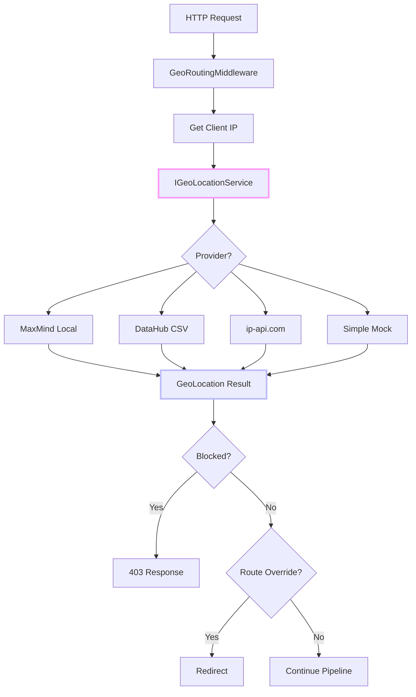
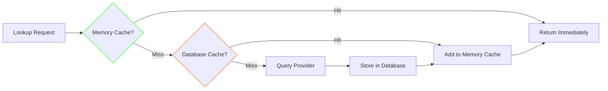

# Geo Detection: Making Your Server a World Traveler (Without Leaving the Rack)

Where in the world is your user? It's a question that sounds philosophical but has very practical answers—and they all start with an IP address.

<datetime class="hidden">2025-11-22T10:30</datetime>
<!-- category -- .NET, GeoIP, ASP.NET Core, NuGet, Middleware, AI-Article -->

# Introduction

IP geolocation is one of those internet superpowers that seems like magic until you understand how it works. Your server receives an IP address, does a lookup against a giant database, and suddenly knows the user is in Tokyo—or trying to look like they're in Tokyo.

The **Mostlylucid.GeoDetection** library provides a pluggable architecture for IP geolocation in ASP.NET Core, supporting multiple data sources (free and commercial), intelligent caching, and middleware for country-based routing and blocking.

**The core challenge:** Different providers offer different trade-offs between accuracy, cost, rate limits, and features. This library abstracts those differences behind a common interface while letting you choose (or combine) providers.

[TOC]

# Architecture: One Interface, Many Data Sources

The design follows a provider pattern—all geolocation services implement `IGeoLocationService`, letting you swap providers without changing application code:



## The Data Sources

| Provider | Data Source | Precision | Cost | Rate Limit | Setup |
|----------|-------------|-----------|------|------------|-------|
| **MaxMind GeoLite2** | Local .mmdb file (~60MB) | City-level | Free (account required) | None | Download database |
| **DataHub CSV** | Downloaded CSV (~27MB) | Country-level | Free (no account) | None | Auto-download |
| **ip-api.com** | REST API | City-level + VPN detection | Free tier | 45/min | None |
| **Simple Mock** | In-memory | First octet | Free | None | None (testing only) |

# Provider Deep Dive

## 1. MaxMind GeoLite2: The Local Lookup

MaxMind's GeoLite2 databases are the industry standard for offline geolocation. They're accurate, fast (no network latency), and update weekly.

```csharp
public class MaxMindGeoLocationService : IGeoLocationService, IDisposable
{
    private DatabaseReader? _reader;

    private GeoLocation? LookupCity(IPAddress ip)
    {
        if (_reader == null) return null;

        if (!_reader.TryCity(ip, out var cityResponse) || cityResponse == null)
            return null;

        return new GeoLocation
        {
            CountryCode = cityResponse.Country.IsoCode ?? "XX",
            CountryName = cityResponse.Country.Name ?? "Unknown",
            ContinentCode = cityResponse.Continent.Code,
            RegionCode = cityResponse.MostSpecificSubdivision?.IsoCode,
            City = cityResponse.City?.Name,
            Latitude = cityResponse.Location?.Latitude,
            Longitude = cityResponse.Location?.Longitude,
            TimeZone = cityResponse.Location?.TimeZone,
            IsVpn = false,
            IsHosting = false
        };
    }
}
```

**Auto-Update Service**: MaxMind databases update every Tuesday. A background service handles this:

```csharp
public class GeoLite2UpdateService : BackgroundService
{
    private const string DownloadBaseUrl = "https://download.maxmind.com/geoip/databases";

    public async Task<bool> DownloadDatabaseAsync(CancellationToken cancellationToken = default)
    {
        var dbName = _options.DatabaseType switch
        {
            GeoLite2DatabaseType.City => "GeoLite2-City",
            GeoLite2DatabaseType.Country => "GeoLite2-Country",
            GeoLite2DatabaseType.ASN => "GeoLite2-ASN",
            _ => "GeoLite2-City"
        };

        var downloadUrl = $"{DownloadBaseUrl}/{dbName}/download?suffix=tar.gz";

        using var client = _httpClientFactory.CreateClient("GeoLite2");

        // Basic Authentication with MaxMind credentials
        var credentials = Convert.ToBase64String(
            Encoding.ASCII.GetBytes($"{_options.AccountId}:{_options.LicenseKey}"));
        client.DefaultRequestHeaders.Authorization =
            new AuthenticationHeaderValue("Basic", credentials);

        var response = await client.GetAsync(downloadUrl, cancellationToken);

        // Download, extract tar.gz, find .mmdb file, reload database
        // ...
    }
}
```

**Private IP Handling**: Not all IPs are routable. We need to detect and handle private/reserved ranges:

```csharp
private static bool IsPrivateOrReserved(IPAddress ip)
{
    if (IPAddress.IsLoopback(ip))
        return true;

    var bytes = ip.GetAddressBytes();

    // IPv4 private ranges
    if (bytes.Length == 4)
    {
        if (bytes[0] == 10) return true;                          // 10.0.0.0/8
        if (bytes[0] == 172 && bytes[1] >= 16 && bytes[1] <= 31)  // 172.16.0.0/12
            return true;
        if (bytes[0] == 192 && bytes[1] == 168) return true;      // 192.168.0.0/16
        if (bytes[0] == 127) return true;                         // 127.0.0.0/8
        if (bytes[0] == 169 && bytes[1] == 254) return true;      // 169.254.0.0/16 (link-local)
    }

    return false;
}
```

## 2. DataHub CSV: The Free Alternative

Don't want to create a MaxMind account? The [DataHub GeoIP2-IPv4](https://datahub.io/core/geoip2-ipv4) dataset provides free country-level geolocation with no strings attached.

```csharp
public class DataHubGeoLocationService : IGeoLocationService, IHostedService
{
    private const string CsvUrl = "https://datahub.io/core/geoip2-ipv4/r/geoip2-ipv4.csv";
    private List<IpRange>? _ipRanges;

    // Binary search for matching range
    private GeoLocation? FindLocation(uint ip)
    {
        if (_ipRanges == null) return null;

        int left = 0, right = _ipRanges.Count - 1;

        while (left <= right)
        {
            var mid = (left + right) / 2;
            var range = _ipRanges[mid];

            if (ip < range.StartIp)
                right = mid - 1;
            else if (ip > range.EndIp)
                left = mid + 1;
            else
            {
                return new GeoLocation
                {
                    CountryCode = range.CountryCode,
                    CountryName = range.CountryName,
                    ContinentCode = range.ContinentCode
                };
            }
        }

        return null;
    }
}
```

**How the CIDR Parsing Works**: IP ranges are stored in CIDR notation (e.g., `192.168.1.0/24`). We need to convert this to start/end IP pairs for binary search:

```csharp
// Parse CIDR notation: "192.168.1.0/24"
var cidrParts = network.Split('/');
if (!IPAddress.TryParse(cidrParts[0], out var baseIp)) continue;
if (!int.TryParse(cidrParts[1], out var prefixLength)) continue;

var bytes = baseIp.GetAddressBytes();
var baseUint = (uint)(bytes[0] << 24 | bytes[1] << 16 | bytes[2] << 8 | bytes[3]);

// Calculate the subnet mask
var mask = prefixLength == 0 ? 0 : uint.MaxValue << (32 - prefixLength);

// Start IP: base AND mask
var startIp = baseUint & mask;

// End IP: start OR inverse mask
var endIp = startIp | ~mask;
```

**Example**: For `192.168.1.0/24`:
- Base: 192.168.1.0 = 3232235776
- Mask: 0xFFFFFF00 (first 24 bits set)
- Start: 192.168.1.0 = 3232235776
- End: 192.168.1.255 = 3232236031

## 3. ip-api.com: The API Option

For city-level accuracy without local databases, ip-api.com provides a free tier with a nice bonus: VPN and hosting detection.

```csharp
public class IpApiGeoLocationService : IGeoLocationService
{
    private const string BaseUrl = "http://ip-api.com/json";
    private readonly SemaphoreSlim _rateLimiter = new(45, 45); // 45 requests per minute

    public async Task<GeoLocation?> GetLocationAsync(string ipAddress, CancellationToken ct)
    {
        // Wait for rate limit permit (with timeout)
        if (!await _rateLimiter.WaitAsync(TimeSpan.FromSeconds(5), ct))
        {
            _logger.LogWarning("ip-api.com rate limit reached");
            return null;
        }

        try
        {
            var url = $"{BaseUrl}/{ipAddress}?fields=status,message,continent,continentCode," +
                      "country,countryCode,region,regionName,city,lat,lon,timezone,hosting,proxy";

            var response = await client.GetAsync(url, ct);
            var result = await response.Content.ReadFromJsonAsync<IpApiResponse>(ct);

            return new GeoLocation
            {
                CountryCode = result.CountryCode ?? "XX",
                CountryName = result.Country ?? "Unknown",
                ContinentCode = result.ContinentCode,
                RegionCode = result.Region,
                City = result.City,
                Latitude = result.Lat,
                Longitude = result.Lon,
                TimeZone = result.Timezone,
                IsVpn = result.Proxy,          // VPN/proxy detection!
                IsHosting = result.Hosting     // Datacenter detection!
            };
        }
        finally
        {
            // Replenish rate limiter (handled by background task)
        }
    }
}
```

**VPN/Hosting Detection**: This is a nice bonus from ip-api.com. We can use it to block datacenter traffic or VPN users:

```csharp
// In GeoRoutingMiddleware
if (_options.BlockVpns && location.IsVpn)
{
    result.IsBlocked = true;
    result.BlockReason = "VPN/Proxy traffic is not allowed";
    return result;
}

if (_options.BlockHosting && location.IsHosting)
{
    result.IsBlocked = true;
    result.BlockReason = "Datacenter/hosting traffic is not allowed";
    return result;
}
```

# The Caching Strategy: Two Layers of Speed

IP geolocation data changes slowly (ISPs don't move IP blocks often), so caching is essential. We use a two-layer approach:



**Layer 1: Memory Cache** (< 1ms lookups)
- IMemoryCache from Microsoft.Extensions.Caching.Memory
- Default: 1 hour TTL
- Max 10,000 entries

**Layer 2: Database Cache** (< 50ms lookups, persistent)
- SQLite or PostgreSQL via EF Core
- Default: 30 days TTL
- Survives app restarts

```csharp
public class CachedGeoLocationService : IGeoLocationService
{
    public async Task<GeoLocation?> GetLocationAsync(string ipAddress, CancellationToken ct)
    {
        // 1. Check memory cache first (fastest)
        var cacheKey = $"geo:{ipAddress}";
        if (_memoryCache.TryGetValue(cacheKey, out GeoLocation? cached))
        {
            _stats.CacheHits++;
            return cached;
        }

        // 2. Check database cache if enabled
        if (_cacheOptions.Enabled && _dbContext != null)
        {
            var dbCached = await GetFromDatabaseCacheAsync(ipAddress, ct);
            if (dbCached != null)
            {
                _stats.CacheHits++;
                CacheInMemory(cacheKey, dbCached); // Promote to memory cache
                return dbCached;
            }
        }

        // 3. Look up from provider
        var location = await _innerService.GetLocationAsync(ipAddress, ct);

        if (location != null)
        {
            CacheInMemory(cacheKey, location);

            if (_cacheOptions.Enabled && _dbContext != null)
                await SaveToDatabaseCacheAsync(ipAddress, location, ct);
        }

        return location;
    }
}
```

# Middleware: Routing and Blocking

The `GeoRoutingMiddleware` provides the HTTP pipeline integration:

```csharp
public async Task InvokeAsync(HttpContext context, IGeoLocationService geoService)
{
    if (!_options.Enabled)
    {
        await _next(context);
        return;
    }

    var ipAddress = GetClientIpAddress(context);

    // Get geographic location
    var location = await geoService.GetLocationAsync(ipAddress, context.RequestAborted);

    // Store in context for downstream access
    if (_options.StoreInContext)
        context.Items[GeoLocationKey] = location;

    // Add X-Country header
    if (_options.AddCountryHeader)
        context.Response.OnStarting(() =>
        {
            context.Response.Headers.TryAdd("X-Country", location.CountryCode);
            return Task.CompletedTask;
        });

    // Evaluate blocking rules
    var blockResult = EvaluateBlockingRules(location, ipAddress);

    if (blockResult.IsBlocked)
    {
        context.Response.StatusCode = _options.BlockedStatusCode; // 451 Unavailable For Legal Reasons
        await context.Response.WriteAsJsonAsync(new
        {
            error = "Access Restricted",
            message = blockResult.BlockReason,
            country = location.CountryCode
        });
        return;
    }

    await _next(context);
}
```

**Client IP Extraction**: Behind proxies, the real client IP isn't in `RemoteIpAddress`. We need to check headers:

```csharp
private string? GetClientIpAddress(HttpContext context)
{
    // Check X-Forwarded-For (standard proxy header)
    var forwardedFor = context.Request.Headers["X-Forwarded-For"].FirstOrDefault();
    if (!string.IsNullOrEmpty(forwardedFor))
    {
        var ips = forwardedFor.Split(',', StringSplitOptions.RemoveEmptyEntries);
        if (ips.Length > 0) return ips[0].Trim(); // First IP is the original client
    }

    // Check X-Real-IP (nginx)
    var realIp = context.Request.Headers["X-Real-IP"].FirstOrDefault();
    if (!string.IsNullOrEmpty(realIp)) return realIp;

    // Fall back to RemoteIpAddress
    return context.Connection.RemoteIpAddress?.ToString();
}
```

## Blocking Rules: Whitelist and Blacklist

Two modes for access control:

**Whitelist Mode**: Only allow specific countries
```csharp
if (_options.AllowedCountries?.Any() == true)
    if (!_options.AllowedCountries.Contains(location.CountryCode, StringComparer.OrdinalIgnoreCase))
    {
        result.IsBlocked = true;
        result.BlockReason = $"Site is only available in: {string.Join(", ", _options.AllowedCountries)}";
        return result;
    }
```

**Blacklist Mode**: Block specific countries
```csharp
if (_options.BlockedCountries?.Any() == true)
    if (_options.BlockedCountries.Contains(location.CountryCode, StringComparer.OrdinalIgnoreCase))
    {
        result.IsBlocked = true;
        result.BlockReason = $"Access from {location.CountryName} ({location.CountryCode}) is not allowed";
        return result;
    }
```

**HTTP 451**: Note the status code choice. HTTP 451 "Unavailable For Legal Reasons" is the appropriate code for geo-blocking (named after Ray Bradbury's Fahrenheit 451).

## Country-Based Routing

Automatically redirect users to localized content:

```csharp
// Configuration
options.CountryRoutes = new Dictionary<string, string>
{
    { "US", "/en-us" },
    { "GB", "/en-gb" },
    { "FR", "/fr" },
    { "DE", "/de" }
};

// In middleware
if (_options.EnableAutoRouting && _options.CountryRoutes.Any())
    if (_options.CountryRoutes.TryGetValue(location.CountryCode, out var route))
        if (!context.Request.Path.StartsWithSegments(route))
        {
            context.Response.Redirect(route + context.Request.Path + context.Request.QueryString);
            return;
        }
```

# Endpoint Routing Extensions

For fine-grained control, we provide endpoint filters:

```csharp
// Only allow US users
app.MapGet("/api/us-only", handler).RequireCountry("US");

// Block specific countries
app.MapGet("/api/content", handler).BlockCountries("CN", "RU");

// Get geo data from context
app.MapGet("/api/my-location", (HttpContext context) =>
{
    var location = context.GetGeoLocation();
    return Results.Ok(new { location.CountryCode, location.City });
});
```

# Test Mode: Development Without Geographic Diversity

Hard to test geo-blocking from your home in New York? The test mode header lets you simulate any country:

```csharp
// Test mode header support
var testMode = context.Request.Headers["ml-geo-test-mode"].FirstOrDefault();
if (!string.IsNullOrEmpty(testMode) && _options.EnableTestMode)
{
    var testLocation = new GeoLocation
    {
        CountryCode = testMode.ToUpperInvariant(),
        CountryName = testMode,
        ContinentCode = "TEST"
    };

    // Process with test location...
}
```

```bash
# Test as if from Germany
curl -H "ml-geo-test-mode: DE" http://localhost/api/content

# Test as if from China (blocked)
curl -H "ml-geo-test-mode: CN" http://localhost/api/restricted
```

# Usage: Putting It Together

**Basic Setup with ip-api.com:**

```csharp
builder.Services.AddGeoRoutingWithIpApi(options =>
{
    options.Enabled = true;
    options.EnableTestMode = true;
    options.AddCountryHeader = true;
    options.StoreInContext = true;
});

app.UseForwardedHeaders();
app.UseGeoRouting();
```

**With MaxMind and Auto-Update:**

```csharp
builder.Services.AddGeoRouting(
    configureRouting: options =>
    {
        options.Enabled = true;
        options.AllowedCountries = new[] { "US", "GB", "CA" };
        options.BlockVpns = true;
    },
    configureProvider: options =>
    {
        options.Provider = GeoProvider.MaxMindLocal;
        options.AccountId = 123456;
        options.LicenseKey = "your-license-key";
        options.EnableAutoUpdate = true;
    }
);
```

**With DataHub (Free, No Account):**

```csharp
builder.Services.AddGeoRoutingWithDataHub();
```

# Connection to Bot Detection

**Borrowed Technique**: The IP detection patterns from the [Bot Detection library](/blog/bot-detection-internals) use similar datacenter IP detection. In fact, you can use both libraries together—GeoDetection identifies *where* the user is, while BotDetection identifies *what* they are.

Combined use case:
```csharp
var location = context.GetGeoLocation();
var botResult = context.GetBotDetectionResult();

if (location?.IsHosting == true && botResult?.IsBot == true)
{
    // Almost certainly a scraper running from a datacenter
    _logger.LogWarning("Bot from datacenter: {Country}, {Confidence}",
        location.CountryCode, botResult.ConfidenceScore);
}
```

# Conclusion: Where in the World?

IP geolocation is a fundamental building block for:
- **Compliance**: GDPR, data residency requirements
- **Localization**: Serve content in the right language
- **Security**: Block high-risk regions, detect VPNs
- **Analytics**: Understand where your users are

**Key Features:**
- Multiple providers (MaxMind, DataHub, ip-api.com)
- Two-layer caching (memory + database)
- Automatic database updates
- Country-based routing and blocking
- VPN/hosting detection (with ip-api.com)
- Test mode for development

**External Data Sources:**
- [MaxMind GeoLite2](https://www.maxmind.com/en/geolite2/signup) - Industry standard
- [DataHub GeoIP2-IPv4](https://datahub.io/core/geoip2-ipv4) - Free, no account
- [ip-api.com](http://ip-api.com/) - Free API with VPN detection

The world is a big place, but with the right data, your server can know exactly where every request comes from.

## Resources

- [Mostlylucid.GeoDetection on NuGet](https://www.nuget.org/packages/Mostlylucid.GeoDetection)
- [MaxMind GeoLite2 Databases](https://www.maxmind.com/en/geolite2/signup)
- [DataHub GeoIP2-IPv4](https://datahub.io/core/geoip2-ipv4)
- [HTTP 451 RFC](https://tools.ietf.org/html/rfc7725)
