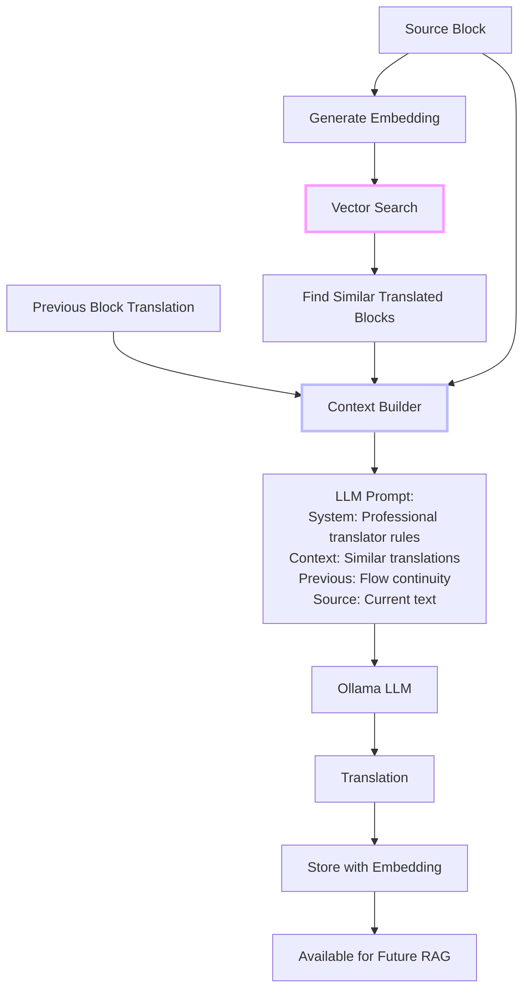
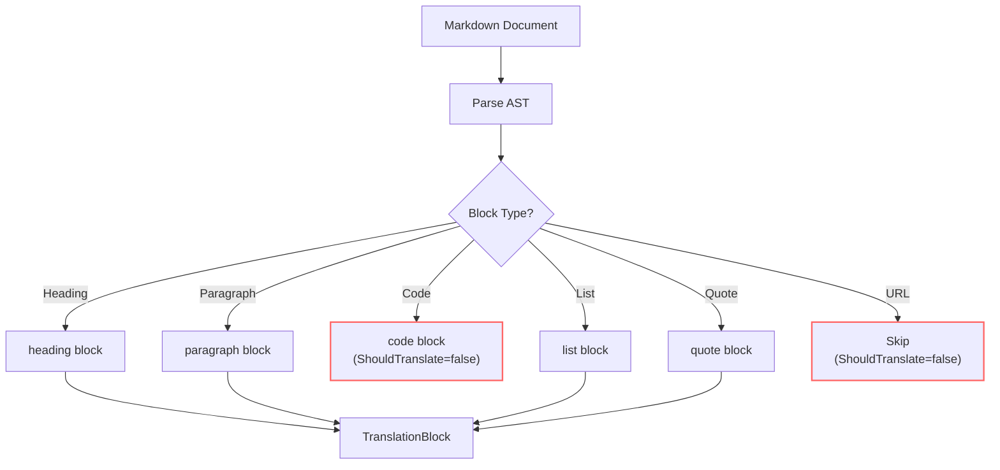

# LLM Slide Translator: Teaching Small Models to Remember Big Documents

What happens when you ask a small local LLM to translate a 50-page technical document? Without help, it forgets the terminology by page 3. With RAG? It becomes surprisingly good.

<datetime class="hidden">2025-11-22T11:00</datetime>
<!-- category -- .NET, LLM, Translation, RAG, NuGet, Semantic Search, AI-Article -->

# Introduction

Translation is easy. *Consistent* translation is hard.

Ask any translator: the challenge isn't converting "server" to "servidor"—it's remembering that you translated it that way on page 1 when you hit page 47. Technical documents have terminology that must stay consistent throughout. "Authentication flow" should always be "flujo de autenticación," not sometimes "proceso de autenticación."

The **Mostlylucid.LlmSlideTranslator** solves this using the same RAG (Retrieval-Augmented Generation) techniques from my [RAG series](/blog/rag-primer), applied to a specific problem: translating long markdown documents with terminology consistency.

**The key insight:** We don't need a giant model with a 100K context window. We need a small model with a good memory.

[TOC]

# The Architecture: RAG for Translation

Traditional machine translation treats each sentence independently. Our approach builds a searchable database of previous translations and includes similar passages in each LLM call:



**Why this works:** When translating paragraph 47, we search the vector database for semantically similar paragraphs from earlier in the document. If paragraph 12 contained similar terminology and was already translated, we include that translation in the context. The LLM sees: "Here's how you translated similar content before—stay consistent."

## The Translation Loop

```
Document: "Understanding Docker Containers"
    |
    v
[Chunk into blocks] --> 50 blocks
    |
    v
[Generate embeddings] --> 50 vectors (768-dim)
    |
    v
[Store all blocks with embeddings]
    |
    v
FOR EACH block:
    |
    +---> [Current block embedding]
    |           |
    |           v
    |     [Vector search: find similar TRANSLATED blocks]
    |           |
    |           v
    |     [Build context: similar blocks + previous block]
    |           |
    |           v
    |     [LLM translate with context]
    |           |
    |           v
    |     [Store translation (now available for future RAG)]
    |
    v
[Output: Fully translated document with consistent terminology]
```

# The Core Translator

The main service orchestrates the translation pipeline:

```csharp
public class LlmSlideTranslator : ILlmSlideTranslator
{
    private readonly IMarkdownChunker _chunker;
    private readonly IEmbeddingGenerator _embeddingGenerator;
    private readonly IVectorStore _vectorStore;
    private readonly IOllamaClient _ollamaClient;

    public async Task<TranslationResult> TranslateAsync(
        string markdown,
        string documentId,
        string sourceLanguage,
        string targetLanguage,
        TranslationMethod method = TranslationMethod.RagLlm,
        CancellationToken cancellationToken = default)
    {
        var stopwatch = Stopwatch.StartNew();

        // Step 1: Chunk the markdown
        var blocks = await _chunker.ChunkAsync(
            markdown,
            documentId,
            sourceLanguage,
            targetLanguage,
            cancellationToken);

        _logger.LogInformation("Chunked document into {Count} blocks", blocks.Count);

        // Step 2: Generate embeddings for all blocks
        blocks = await _embeddingGenerator.GenerateEmbeddingsAsync(blocks, cancellationToken);

        // Step 3: Store blocks with embeddings (ready for RAG)
        await _vectorStore.StoreAsync(blocks, documentId, cancellationToken);

        // Step 4: Translate using RAG-enhanced LLM
        blocks = await TranslateWithRagLlmAsync(blocks, cancellationToken);

        // Step 5: Update stored blocks with translations
        await _vectorStore.StoreAsync(blocks, documentId, cancellationToken);

        var result = new TranslationResult
        {
            DocumentId = documentId,
            Blocks = blocks,
            Duration = stopwatch.Elapsed
        };

        return result;
    }
}
```

## The RAG Translation Loop

The magic happens here—each block is translated with context from similar earlier blocks:

```csharp
private async Task<List<TranslationBlock>> TranslateWithRagLlmAsync(
    List<TranslationBlock> blocks,
    CancellationToken cancellationToken)
{
    TranslationBlock? previousBlock = null;

    foreach (var block in blocks.OrderBy(b => b.Index))
    {
        await TranslateBlockAsync(block, previousBlock, cancellationToken);
        previousBlock = block;
    }

    return blocks;
}

public async Task<TranslationBlock> TranslateBlockAsync(
    TranslationBlock block,
    TranslationBlock? previousBlock = null,
    CancellationToken cancellationToken = default)
{
    if (!block.ShouldTranslate)
    {
        block.TranslatedText = block.Text; // Code blocks, URLs, etc.
        return block;
    }

    // RAG: Find similar earlier blocks that have already been translated
    var similarBlocks = new List<TranslationBlock>();
    if (block.Embedding != null)
    {
        var searchResults = await _vectorStore.SearchAsync(
            block.Embedding,
            block.DocumentId,
            _config.Rag.TopK,         // Retrieve top 3 similar
            _config.Rag.MinSimilarity, // Minimum 0.5 cosine similarity
            cancellationToken);

        similarBlocks = searchResults
            .Where(r => r.Block.Index < block.Index)           // Only earlier blocks
            .Where(r => !string.IsNullOrEmpty(r.Block.TranslatedText)) // Must be translated
            .Select(r => r.Block)
            .ToList();
    }

    // Build context with sliding window + RAG
    var context = new TranslationContext
    {
        CurrentBlock = block,
        PreviousBlock = _config.Rag.UseSlidingWindow ? previousBlock : null,
        SimilarBlocks = similarBlocks.Take(_config.Rag.MaxContextBlocks).ToList()
    };

    // Translate with LLM
    var translatedText = await _ollamaClient.TranslateWithContextAsync(context, cancellationToken);
    block.TranslatedText = translatedText;

    return block;
}
```

# Markdown-Aware Chunking

Translation unit boundaries matter. Bad chunking breaks semantic coherence:



```csharp
public class MarkdownChunker : IMarkdownChunker
{
    private readonly MarkdownPipeline _pipeline = new MarkdownPipelineBuilder()
        .UseAdvancedExtensions()
        .Build();

    public Task<List<TranslationBlock>> ChunkAsync(
        string markdown,
        string documentId,
        string sourceLanguage,
        string targetLanguage,
        CancellationToken cancellationToken = default)
    {
        var document = Markdown.Parse(markdown, _pipeline);
        var blocks = new List<TranslationBlock>();
        var index = 0;

        foreach (var block in document)
        {
            var translationBlock = CreateTranslationBlock(
                block, documentId, sourceLanguage, targetLanguage, index);

            if (translationBlock != null)
            {
                blocks.Add(translationBlock);
                index++;
            }
        }

        return Task.FromResult(blocks);
    }

    private string DetermineBlockType(Block block)
    {
        return block switch
        {
            HeadingBlock => "heading",
            FencedCodeBlock => "code",   // Don't translate!
            CodeBlock => "code",          // Don't translate!
            QuoteBlock => "quote",
            ListBlock => "list",
            ParagraphBlock => "paragraph",
            _ => "other"
        };
    }

    private bool ShouldTranslateBlock(Block block, string blockType)
    {
        // Don't translate code blocks
        if (blockType == "code") return false;

        // Don't translate URLs
        if (block is ParagraphBlock paragraph)
        {
            var text = ExtractText(block);
            if (text.StartsWith("/") || text.StartsWith("http://") ||
                text.StartsWith("https://"))
                return false;
        }

        return true;
    }
}
```

**Key Decision**: Code blocks are preserved exactly. URLs are kept as-is. Only prose gets translated.

# The Prompt Engineering

The LLM prompt is carefully structured to maintain terminology consistency:

```csharp
private string BuildPrompt(TranslationContext context)
{
    var sb = new StringBuilder();

    // System prompt - professional translation rules
    sb.AppendLine(GetDefaultSystemPrompt(context.CurrentBlock));
    sb.AppendLine();

    // Sliding window: previous block for flow continuity
    if (context.PreviousBlock?.TranslatedText != null)
    {
        sb.AppendLine("Previous block from the same document:");
        sb.AppendLine("[CTX-PREV]");
        sb.AppendLine($"EN: {context.PreviousBlock.Text}");
        sb.AppendLine($"{context.PreviousBlock.TargetLanguage.ToUpper()}: {context.PreviousBlock.TranslatedText}");
        sb.AppendLine();
    }

    // RAG context: similar earlier translations
    if (context.SimilarBlocks.Count > 0)
    {
        sb.AppendLine("Context from earlier in the document (use the same terminology):");
        for (var i = 0; i < context.SimilarBlocks.Count; i++)
        {
            var similarBlock = context.SimilarBlocks[i];
            if (!string.IsNullOrEmpty(similarBlock.TranslatedText))
            {
                sb.AppendLine($"[CTX-{i + 1}]");
                sb.AppendLine($"EN: {similarBlock.Text}");
                sb.AppendLine($"{similarBlock.TargetLanguage.ToUpper()}: {similarBlock.TranslatedText}");
                sb.AppendLine();
            }
        }
    }

    // The actual text to translate
    sb.AppendLine("Translate the following text:");
    sb.AppendLine("<<<SOURCE");
    sb.AppendLine(context.CurrentBlock.Text);
    sb.AppendLine("SOURCE>>>");
    sb.AppendLine();
    sb.AppendLine($"Return only the {context.CurrentBlock.TargetLanguage.ToUpper()} translation:");

    return sb.ToString();
}

private string GetDefaultSystemPrompt(TranslationBlock block)
{
    return $@"You are a professional translator for technical documentation.
Translate *only* the [SOURCE] text from {block.SourceLanguage.ToUpper()} to {block.TargetLanguage.ToUpper()}.

Rules:
- Do NOT translate code, URLs, or technical identifiers
- Preserve markdown formatting
- Use the same terminology as shown in the context blocks
- Maintain the same tone and style
- Return ONLY the translation, no explanations";
}
```

**Example Prompt** (translating block 47 of a Docker tutorial):

```
You are a professional translator for technical documentation.
Translate *only* the [SOURCE] text from EN to ES.

Rules:
- Do NOT translate code, URLs, or technical identifiers
- Preserve markdown formatting
- Use the same terminology as shown in the context blocks
- Maintain the same tone and style
- Return ONLY the translation, no explanations

Previous block from the same document:
[CTX-PREV]
EN: Containers are lightweight and isolated environments.
ES: Los contenedores son entornos ligeros y aislados.

Context from earlier in the document (use the same terminology):
[CTX-1]
EN: Docker containers provide isolation between applications.
ES: Los contenedores de Docker proporcionan aislamiento entre aplicaciones.

[CTX-2]
EN: Each container runs in its own isolated environment.
ES: Cada contenedor se ejecuta en su propio entorno aislado.

Translate the following text:
<<<SOURCE
When deploying containers to production, ensure proper isolation between services.
SOURCE>>>

Return only the ES translation:
```

The LLM sees that "containers" = "contenedores" and "isolation" = "aislamiento" from the context, and will use consistent terminology.

# Embedding Generation: The Semantic Memory

We use embeddings to find semantically similar content—not just keyword matches. "Container isolation" and "service separation" might be discussing similar concepts even without shared words.

```csharp
public class EmbeddingGenerator : IEmbeddingGenerator, IDisposable
{
    // Supports both Ollama API and local LlamaSharp GGUF models
    public async Task<float[]> GenerateEmbeddingAsync(string text, CancellationToken ct)
    {
        await EnsureInitializedAsync();

        if (_useOllama)
        {
            return await GenerateOllamaEmbeddingAsync(text, ct);
        }
        else
        {
            if (_embedder == null) throw new InvalidOperationException("Embedder not initialized");
            var embeddings = await Task.Run(() => _embedder.GetEmbeddings(text), ct);
            return embeddings.FirstOrDefault() ?? Array.Empty<float>();
        }
    }

    // Batch processing for efficiency
    public async Task<List<TranslationBlock>> GenerateEmbeddingsAsync(
        List<TranslationBlock> blocks,
        CancellationToken ct)
    {
        var tasks = blocks.Select(async block =>
        {
            if (block.ShouldTranslate)
                block.Embedding = await GenerateEmbeddingAsync(block.Text, ct);
            return block;
        });

        var results = await Task.WhenAll(tasks);
        return results.ToList();
    }

    // Cosine similarity for vector search
    public float CalculateSimilarity(float[] embedding1, float[] embedding2)
    {
        var dotProduct = 0.0f;
        var magnitude1 = 0.0f;
        var magnitude2 = 0.0f;

        for (var i = 0; i < embedding1.Length; i++)
        {
            dotProduct += embedding1[i] * embedding2[i];
            magnitude1 += embedding1[i] * embedding1[i];
            magnitude2 += embedding2[i] * embedding2[i];
        }

        return dotProduct / (MathF.Sqrt(magnitude1) * MathF.Sqrt(magnitude2));
    }
}
```

**Embedding Model**: We use `nomic-embed-text` (768 dimensions) by default—it's fast and handles multilingual content well.

# Vector Storage: Two Options

## File-Based (Simple)

For smaller projects, JSON file storage works fine:

```csharp
public class FileVectorStore : IVectorStore
{
    private readonly SemaphoreSlim _fileLock = new(1, 1);

    public async Task<List<(TranslationBlock Block, float Similarity)>> SearchAsync(
        float[] queryEmbedding,
        string documentId,
        int topK,
        float minSimilarity = 0.0f,
        CancellationToken ct = default)
    {
        var blocks = await GetDocumentBlocksAsync(documentId, ct);

        var results = blocks
            .Where(b => b.Embedding != null)
            .Select(b => new
            {
                Block = b,
                Similarity = _embeddingGenerator.CalculateSimilarity(queryEmbedding, b.Embedding!)
            })
            .Where(r => r.Similarity >= minSimilarity)
            .OrderByDescending(r => r.Similarity)
            .Take(topK)
            .Select(r => (r.Block, r.Similarity))
            .ToList();

        return results;
    }
}
```

## Qdrant (Enterprise)

For large-scale deployments, Qdrant provides proper vector database features:

```csharp
public class QdrantVectorStore : IVectorStore
{
    public async Task<List<(TranslationBlock Block, float Similarity)>> SearchAsync(
        float[] queryEmbedding,
        string documentId,
        int topK,
        float minSimilarity = 0.0f,
        CancellationToken ct = default)
    {
        var searchResult = await _client.SearchAsync(
            _config.Qdrant.CollectionName,
            queryEmbedding,
            limit: (ulong)topK,
            filter: new Filter
            {
                Must =
                {
                    new Condition
                    {
                        Field = new FieldCondition
                        {
                            Key = "documentId",
                            Match = new Match { Keyword = documentId }
                        }
                    }
                }
            },
            scoreThreshold: minSimilarity,
            cancellationToken: ct);

        // Convert Qdrant results to TranslationBlocks...
    }
}
```

# Translation Methods: Four Approaches

The library supports multiple translation strategies:

```csharp
public enum TranslationMethod
{
    LlmOnly,      // LLM only, no RAG context
    NmtOnly,      // Neural Machine Translation baseline (e.g., Google Translate API)
    NmtPlusLlm,   // NMT baseline + LLM post-editing with RAG
    RagLlm        // RAG-enhanced LLM (recommended, default)
}
```

**Hybrid NMT+LLM**: Get fast baseline from NMT, then improve with RAG:

```csharp
private async Task<List<TranslationBlock>> TranslateWithNmtPlusLlmAsync(
    List<TranslationBlock> blocks,
    CancellationToken ct)
{
    // Fast baseline with Neural Machine Translation
    blocks = await _nmtClient.TranslateBatchAsync(blocks, ct);

    // Quality improvement with LLM + RAG
    return await TranslateWithRagLlmAsync(blocks, ct);
}
```

# Real-Time Progress with SignalR

For long documents, users want to see progress. The streaming service provides real-time updates:

```csharp
public async IAsyncEnumerable<TranslationUpdate> StreamTranslationAsync(
    string markdown,
    string documentId,
    string sourceLanguage,
    string targetLanguage,
    TranslationMethod method)
{
    // ... setup ...

    for (var i = 0; i < blocks.Count; i++)
    {
        var block = blocks[i];

        yield return new TranslationUpdate
        {
            DocumentId = documentId,
            Status = "Translating",
            Message = $"Translating block {i + 1} of {blocks.Count}",
            Progress = new { PercentComplete = (float)(i + 1) / blocks.Count * 100 }
        };

        // SignalR broadcast
        await _hubContext.Clients.Group(groupName).SendAsync("BlockTranslationStarted", new
        {
            DocumentId = documentId,
            BlockIndex = i,
            block.BlockId
        });

        var translatedBlock = await translator.TranslateBlockAsync(block, previousBlock);

        // SignalR broadcast with result
        await _hubContext.Clients.Group(groupName).SendAsync("BlockTranslationComplete", new
        {
            DocumentId = documentId,
            BlockIndex = i,
            OriginalText = block.Text,
            translatedBlock.TranslatedText
        });

        previousBlock = translatedBlock;
    }
}
```

# Quality Evaluation

How do you know if the translation is any good? The library includes comparison tools:

```csharp
public class TranslationComparer : ITranslationComparer
{
    // Levenshtein distance for similarity measurement
    public int CalculateEditDistance(string text1, string text2)
    {
        var len1 = text1.Length;
        var len2 = text2.Length;
        var matrix = new int[len1 + 1, len2 + 1];

        for (var i = 0; i <= len1; i++) matrix[i, 0] = i;
        for (var j = 0; j <= len2; j++) matrix[0, j] = j;

        for (var i = 1; i <= len1; i++)
        for (var j = 1; j <= len2; j++)
        {
            var cost = text1[i - 1] == text2[j - 1] ? 0 : 1;
            matrix[i, j] = Math.Min(
                Math.Min(matrix[i - 1, j] + 1, matrix[i, j - 1] + 1),
                matrix[i - 1, j - 1] + cost);
        }

        return matrix[len1, len2];
    }

    // BLEU-1 score (unigram precision)
    public float CalculateBleuScore(string reference, string candidate)
    {
        var refTokens = reference.ToLower().Split(' ', StringSplitOptions.RemoveEmptyEntries);
        var candTokens = candidate.ToLower().Split(' ', StringSplitOptions.RemoveEmptyEntries);

        var refSet = new HashSet<string>(refTokens);
        var matchCount = candTokens.Count(token => refSet.Contains(token));

        var precision = (float)matchCount / candTokens.Length;

        // Brevity penalty
        var brevityPenalty = candTokens.Length < refTokens.Length
            ? MathF.Exp(1 - (float)refTokens.Length / candTokens.Length)
            : 1.0f;

        return precision * brevityPenalty;
    }
}
```

Compare RAG-enhanced vs plain LLM translation:

```csharp
var ragResult = await translator.TranslateAsync(markdown, "doc1", "en", "es", TranslationMethod.RagLlm);
var plainResult = await translator.TranslateAsync(markdown, "doc1", "en", "es", TranslationMethod.LlmOnly);

var comparison = await comparer.CompareAsync(ragResult, plainResult);
Console.WriteLine($"Overall similarity: {comparison.SimilarityScore:P2}");
```

# Configuration

```csharp
public class LlmSlideTranslatorConfig
{
    public OllamaConfig Ollama { get; set; } = new();
    public EmbeddingConfig Embedding { get; set; } = new();
    public RagConfig Rag { get; set; } = new();
    public string DataPath { get; set; } = "./data";
    public string VectorStoreProvider { get; set; } = "File"; // or "Qdrant"
}

public class OllamaConfig
{
    public string Endpoint { get; set; } = "http://localhost:11434";
    public string Model { get; set; } = "llama3.2:3b";
    public float Temperature { get; set; } = 0.3f;  // Low for consistency
    public int MaxTokens { get; set; } = 2048;
}

public class RagConfig
{
    public int TopK { get; set; } = 3;                    // Retrieve 3 similar blocks
    public bool UseSlidingWindow { get; set; } = true;    // Include previous block
    public float MinSimilarity { get; set; } = 0.5f;      // Cosine similarity threshold
    public int MaxContextBlocks { get; set; } = 5;        // Max total context
}
```

# Connection to RAG Architecture

This project is essentially a specialized application of the RAG architecture described in my [RAG series](/blog/rag-primer):

**Borrowed from RAG:**
- Embedding generation for semantic similarity
- Vector storage and search (file-based or Qdrant)
- Context construction with retrieved documents
- Prompt engineering with structured context

**Translation-Specific Additions:**
- Sliding window for flow continuity (previous block)
- Markdown-aware chunking (skip code, preserve structure)
- Terminology consistency focus (same concept = same translation)
- Quality comparison tools (BLEU, edit distance)

# Usage Example

```csharp
// Program.cs
builder.Services.AddLlmSlideTranslator(builder.Configuration, "LlmSlideTranslator");

// Translation service
public class TranslationController : Controller
{
    private readonly ILlmSlideTranslator _translator;

    [HttpPost("translate")]
    public async Task<IActionResult> Translate([FromBody] TranslationRequest request)
    {
        var result = await _translator.TranslateAsync(
            request.Markdown,
            Guid.NewGuid().ToString(),
            request.SourceLanguage,
            request.TargetLanguage,
            TranslationMethod.RagLlm);

        return Ok(new
        {
            translatedText = result.GetTranslatedText(),
            blockCount = result.Blocks.Count,
            duration = result.Duration.TotalSeconds
        });
    }
}
```

# Conclusion: Small Models, Big Memory

The Mostlylucid.LlmSlideTranslator demonstrates that you don't need massive LLMs for quality translation. With RAG:

- **Small models work**: A 3B parameter model with context beats a 70B model without it
- **Consistency comes from memory**: Previous translations guide future ones
- **Privacy is preserved**: Everything runs locally, no cloud APIs required
- **Context is king**: ~1-2K tokens per request fits any local model

**Key Features:**
- RAG-assisted terminology consistency
- Sliding window for flow continuity
- Markdown-aware chunking (preserves code, URLs)
- Multiple translation methods (LLM, NMT, hybrid)
- File or Qdrant vector storage
- Real-time SignalR progress updates

The same techniques could apply to:
- Book series (character names across volumes)
- Legal documents (defined terms)
- API documentation (consistent code terminology)
- Any long-form content needing consistency

## Resources

- [Mostlylucid.LlmSlideTranslator on NuGet](https://www.nuget.org/packages/Mostlylucid.LlmSlideTranslator)
- [RAG Part 1: Origins and Fundamentals](/blog/rag-primer)
- [RAG Part 2: Architecture and Internals](/blog/rag-architecture)
- [Ollama](https://ollama.com/) - Local LLM runtime
- [Qdrant](https://qdrant.tech/) - Vector database
- [Markdig](https://github.com/xoofx/markdig) - Markdown parser
